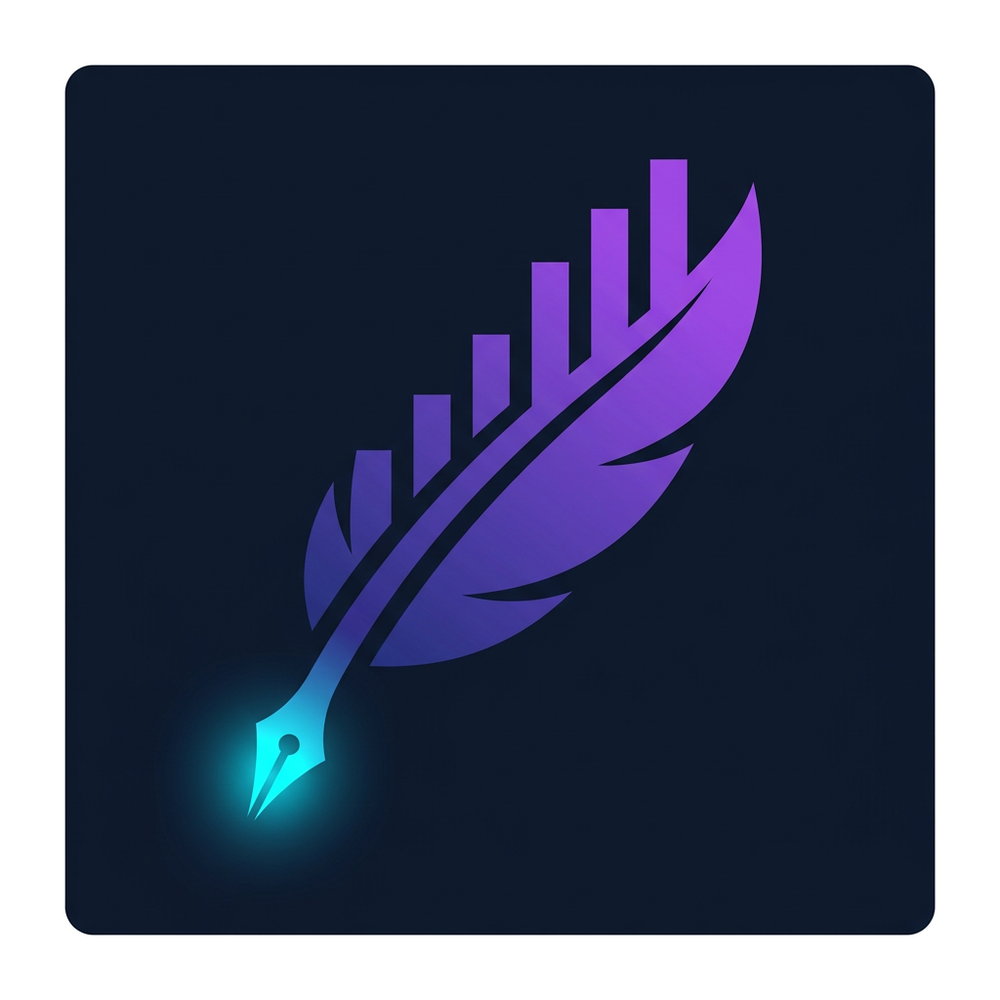
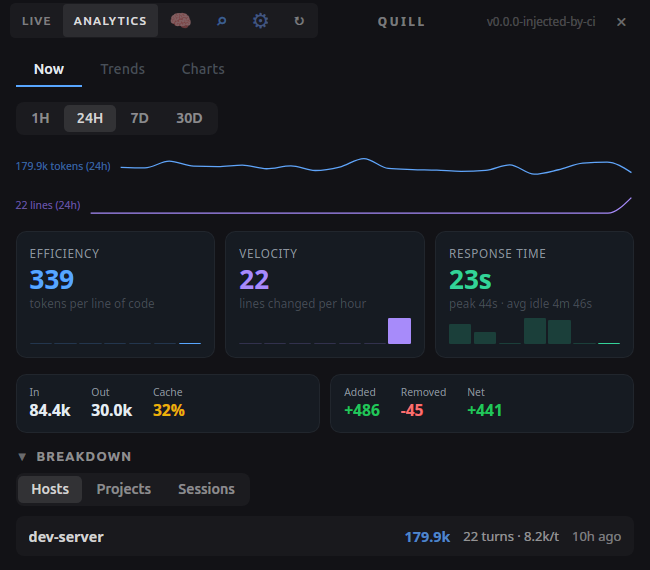
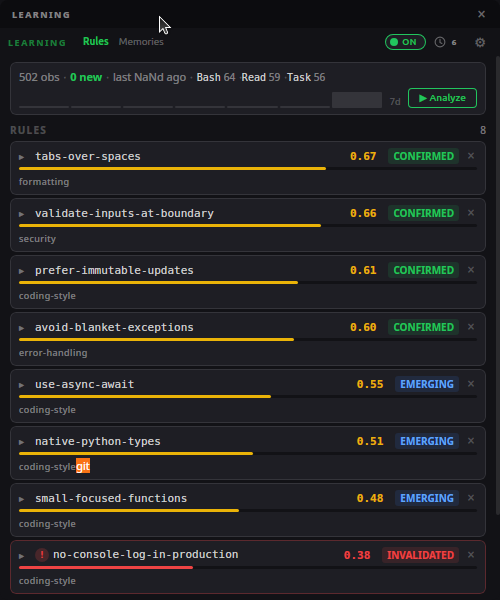
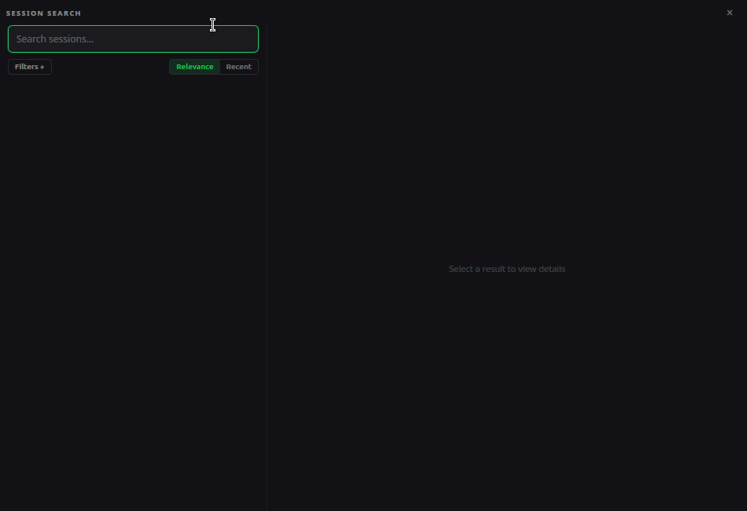
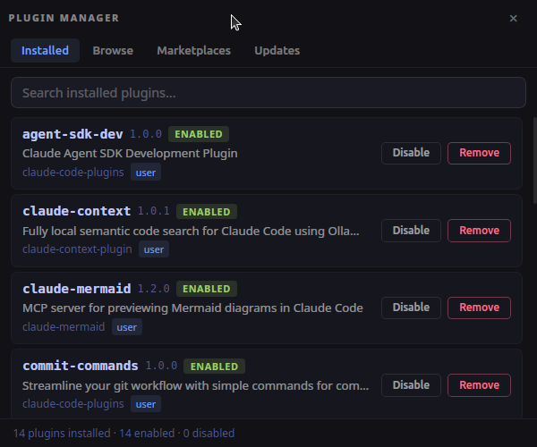
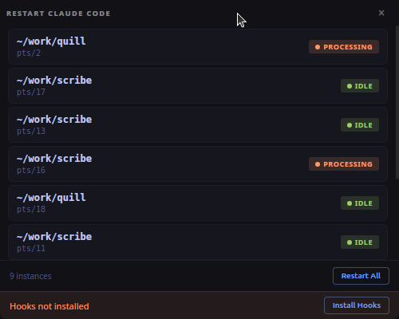
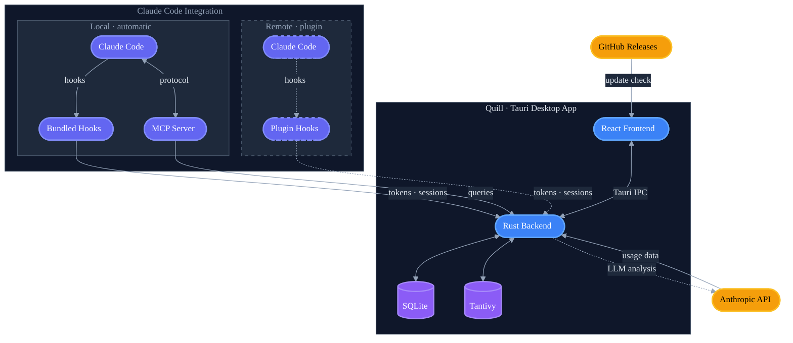

# Quill

<p align="center">
  
</p>

A cross-platform desktop widget that displays your Claude AI plan usage in a compact, always-on-top floating window. Built with Tauri + React.

## Features

### Live usage
- Per-5-hour and per-7-day usage with progress bars
- Per-model breakdown (Sonnet, Opus, Code, OAuth)
- Color-coded percentages that transition green → yellow → red as usage increases
- Countdown timers showing time until usage resets
- Three time display modes (pace marker, dual bars, background fill)
- Token sparkline showing per-turn token counts over time

### Analytics
- Historical usage charts with dual-axis visualization (utilization + tokens)
- Per-bucket statistics with min/max/average, trend indicators, and sparklines
- **Breakdown panels** — token usage grouped by host, project, or session with per-item data deletion
- Time range selection (1h, 24h, 7d, 30d)
- **Tabbed dashboard** — Now (current period stats), Trends (historical patterns), and Charts (4 synchronized mini-charts)
- Activity heatmap showing usage patterns over time
- Project focus, session health, and learning progress insight cards
- Efficiency metrics (cache hit ratio, avg tokens per turn)
- Average response time, peak response time, and average idle time per session

### Session search
- Full-text search across all Claude Code sessions (powered by Tantivy)
- Filter by project, host, role, date range, and git branch
- Snippet highlighting with expandable message context
- Opens in a dedicated search window from the titlebar

### Token tracking
- Per-turn input/output/cache token counts via Claude Code hook
- **Multi-host support** — remote Claude Code instances can report usage over the network
- Token sparkline in the live view and dual-axis chart overlay in analytics

### Learning
- Integrated side panel that shows learned usage rules, observation stats, and analysis history
- Configurable triggers: on-demand, session-end, periodic, or combined
- Rule state tracking (emerging → confirmed → stale → invalidated)
- Domain-grouped rules with confidence scores
- Run history with real-time analysis logs
- Git history integration for cross-source pattern synthesis

### Memory optimizer
- Scans your Claude Code memory files and suggests improvements (merge duplicates, update stale content, remove obsolete entries)
- Approval-based workflow — review each suggestion with a diff preview before applying
- Undo any applied change to restore the original file
- Batched "optimize all" to review and apply suggestions across an entire project

### MCP server
- Gives Claude Code direct access to your indexed session history via MCP tools
- **`search_history`** — full-text search across all sessions by content, edits, commands, or tool use
- **`list_projects`** / **`list_sessions`** — browse projects and sessions
- **`get_session_context`** — retrieve surrounding messages for a search hit
- **`get_branch_activity`** — see all work done on a git branch
- **`get_token_usage`** — query token usage and cost analytics
- **`get_learned_rules`** — retrieve learned coding patterns
- **`get_tool_details`** — inspect full tool input/output for a specific action
- Automatically configured on local installs when the app starts — no plugin or manual setup needed
- For remote hosts, available after installing the plugin and running `/quill:setup`

### Build skill
- `/quill:build` command orchestrates multi-agent feature implementation
- Explores the codebase, creates wave-based implementation plans, and dispatches parallel agents
- Available via the plugin on remote hosts

### Plugin manager
- Browse, install, update, and remove Claude Code plugins from a marketplace
- View installed plugins, available updates, and manage marketplaces
- Opens in a dedicated window from the titlebar

### Restart orchestrator
- Monitor and restart Claude Code instances from within Quill
- Detects terminal type (Tmux, Plain) and tracks instance status
- Opens in a dedicated window from the titlebar

### Code stats
- Lines of code added/removed tracked per session, grouped by language
- Code changes sparkline in the Now tab showing change frequency over time
- Velocity metrics (tokens/hour, sessions/day)

### Desktop integration
- **System tray** with Show / Always on Top / Check for Update / Quit
- **In-app updater** — checks on startup and every 4 hours; yellow "Update" button appears in the titlebar
- Always-on-top mode (toggleable from tray menu)
- Semi-transparent dark theme with custom drag-to-move titlebar
- Remembers window position and size across restarts
- Auto-refreshes usage every 60 seconds
- Read-only OAuth — reads Claude Code's token, never refreshes it
- **Zoom controls** — Ctrl+/- to zoom all windows in or out

## Screenshots

<table>
  <tr>
    <td align="center"><strong>Live + Analytics</strong></td>
    <td align="center"><strong>Learning</strong></td>
    <td align="center"><strong>Session search</strong></td>
  </tr>
  <tr>
    <td></td>
    <td></td>
    <td></td>
  </tr>
  <tr>
    <td align="center"><strong>Plugin manager</strong></td>
    <td align="center"><strong>Restart orchestrator</strong></td>
    <td></td>
  </tr>
  <tr>
    <td></td>
    <td></td>
    <td></td>
  </tr>
</table>

## Architecture



## Prerequisites

- [Claude Code](https://docs.anthropic.com/en/docs/claude-code) installed and logged in (`claude /login`)

### For development

- [Rust](https://rustup.rs/) (stable)
- [Node.js](https://nodejs.org/) 18+
- System dependencies for Tauri (Linux):
  ```bash
  sudo apt install libwebkit2gtk-4.1-dev libappindicator3-dev librsvg2-dev patchelf
  ```

## Installation

### From releases

Download the latest release for your platform from the [Releases](../../releases) page:
- **Linux**: `.deb` (recommended) or `.AppImage`
- **Windows**: `.exe`
- **macOS**: `.dmg`

#### Linux setup

**Debian/Ubuntu (recommended)** — installs the binary, desktop entry, and icons system-wide:

```bash
sudo dpkg -i Quill_*_linux_amd64.deb
```

**AppImage** — portable executable, no installation required:

```bash
chmod +x Quill_*_linux_amd64.AppImage
./Quill_*_linux_amd64.AppImage
```

#### Linux uninstall

To fully remove Quill and its data:

```bash
# If installed via .deb:
sudo dpkg -r quill

# If using AppImage:
rm -f ~/Applications/Quill_*_linux_amd64.AppImage

# Remove app data (usage database, auth secret, logs, etc.)
# macOS:
rm -rf ~/Library/Application\ Support/com.quilltoolkit.app
# Linux:
rm -rf ~/.local/share/com.quilltoolkit.app

# Remove hook scripts, MCP server, and config
rm -rf ~/.config/quill

# Remove Claude Code integration added by the app
# (hooks in ~/.claude/settings.json with _source: "quill-setup",
#  MCP entry in ~/.claude.json, and CLAUDE.md section are left in place
#  — remove manually if desired)
```

### From source

```bash
git clone https://github.com/sharaf-nassar/quill.git
cd quill
npm install
cargo tauri build
```

The built binary will be in `src-tauri/target/release/`.

## Setup

The widget reads OAuth tokens from Claude Code's credentials file (`~/.claude/.credentials.json`). Make sure you are logged in:

```bash
claude /login
```

No additional configuration is needed — the widget starts tracking utilization immediately.

## Token Tracking, Learning & Session Search

The app includes an HTTP server (port `19876`, configurable via `QUILL_PORT`) that receives data from Claude Code via hooks. This powers three features:

- **Token tracking** — per-turn input/output/cache token counts, powering the sparkline in the live view and the token overlay on the analytics chart
- **Learning** — observes tool usage patterns across sessions and can analyze them to extract reusable rules (stored in `~/.claude/rules/learned/`)
- **Session search** — indexes Claude Code session transcripts for full-text search with filters

The HTTP server uses bearer-token authentication and rate limiting to secure incoming data.

### Local setup (automatic)

When the Quill app runs on the same machine as Claude Code, **everything is configured automatically** on app startup — no manual steps required. The app:

1. Deploys hook scripts to `~/.config/quill/scripts/`
2. Deploys the MCP server to `~/.config/quill/mcp/`
3. Registers hooks in `~/.claude/settings.json`
4. Registers the MCP server in `~/.claude.json`
5. Writes connection config to `~/.config/quill/config.json`
6. Adds MCP usage instructions to `~/.claude/CLAUDE.md`

Just install the app, launch it, and restart Claude Code. Token tracking, learning, session search, and MCP tools will all be active.

### Remote setup (plugin required)

When Claude Code runs on a different machine than the Quill app (e.g. a remote dev server), install the plugin on the remote machine to relay data over the network:

1. Add the marketplace:

```
/plugin marketplace add sharaf-nassar/quill
```

2. Install the plugin:

```
/plugin install quill@sharaf-nassar/quill
```

3. **Restart** Claude Code, then run the setup skill:

```
/quill:setup
```

The setup skill will ask for the IP address of the machine running the Quill app and the bearer secret. After setup, every Claude Code turn on the remote machine will report token counts and tool observations to the widget over the network.

### Multi-host setup

Multiple remote machines can report to a single Quill app. Install the plugin on each remote machine and point them to the same widget IP during setup. Each machine's hostname appears in the widget for filtering.

### Using the learning panel

Once observations are being collected (either via local auto-setup or remote plugin):

1. Click the **✦ button** in the titlebar to open the learning panel
2. Toggle learning **ON** with the switch in the panel header
3. Choose a trigger mode:
   - **On-demand** — click "Analyze" in the panel to run analysis manually
   - **Session-end** — automatically analyzes after each Claude Code session ends
   - **Periodic** — runs analysis on a configurable interval
   - **Combined** — both session-end and periodic enabled together
4. Analysis extracts patterns from observations and creates rule files in `~/.claude/rules/learned/`
5. Learned rules appear as cards in the panel with confidence scores and domain tags

You can also trigger analysis from Claude Code by running the learn skill:

```
/quill:learn
```

### Verify

```bash
# Check the server is running
curl http://localhost:19876/api/v1/health

# Send a test payload
curl -X POST http://localhost:19876/api/v1/tokens \
  -H 'Content-Type: application/json' \
  -d '{"session_id":"test","hostname":"dev","input_tokens":100,"output_tokens":50,"cache_creation_input_tokens":10,"cache_read_input_tokens":5}'
```

## Development

```bash
npm install
cargo tauri dev
```

## Controls

- **Drag the title bar** to move the window
- **Drag any edge or corner** to resize
- **Live tab** to toggle the live usage view
- **Analytics tab** to toggle the analytics view
- **Brain icon (🧠)** to open the learning window
- **Search icon (⌕)** to open the session search window
- **Plugin icon (⚙)** to open the plugin manager — shows a badge when updates are available
- **Restart icon (↻)** to open the restart panel
- **System tray icon** — left-click to show the widget; menu has Always on Top, Check for Update, and Quit
- **Ctrl+/- (or Cmd+/-)** to zoom in/out across all windows

## Project structure

```
src/                          # React frontend
  main.tsx                    # Entry point
  App.tsx                     # Main app component with tiling layout
  types.ts                    # Shared TypeScript interfaces
  components/
    TitleBar.tsx              # Custom titlebar (drag, view toggles, plugins, restart, update)
    SectionHeader.tsx         # Reusable collapsible section header
    UsageRow.tsx              # Usage row with progress bar + token sparkline
    UsageDisplay.tsx          # Container for all usage rows
    analytics/
      AnalyticsView.tsx       # Tabbed analytics (Now, Trends, Charts)
      NowTab.tsx              # Current period stats with code sparkline
      TrendsTab.tsx           # Historical trend analysis
      ChartsTab.tsx           # Four synchronized mini-charts
      BreakdownPanel.tsx      # Host/project/session breakdown with deletion
      UsageChart.tsx          # Dual-axis chart (utilization + tokens)
      MiniChart.tsx           # Compact chart for the Charts tab
      StatsPanel.tsx          # Per-bucket statistics panel
      ActivityHeatmap.tsx     # Usage activity heatmap
      InsightCard.tsx         # Reusable insight card component
      ProjectFocusCard.tsx    # Project focus insight card
      SessionHealthCard.tsx   # Session health insight card
      LearningProgressCard.tsx # Learning progress insight card
      CompactStatsRow.tsx     # Compact stats display row
      CodeSparkline.tsx       # Code changes sparkline
      TokenSparkline.tsx      # Token usage sparkline
      TabBar.tsx              # Analytics tab navigation
      TogglePills.tsx         # Toggle pill selectors
      ChartCrosshairContext.tsx # Shared crosshair context for synced charts
      shared.tsx              # Shared analytics utilities
    learning/
      StatusStrip.tsx         # Observation stats and sparkline
      RuleCard.tsx            # Individual learned rule display
      SuggestionCard.tsx      # Memory optimization suggestion with diff view
      MemoriesPanel.tsx       # Memory optimizer panel with approve/undo
      DomainBreakdown.tsx     # Rules grouped by domain
      RunHistory.tsx          # Past analysis run log
      FloatingRunsWindow.tsx  # Floating window for run history with live logs
    sessions/
      SearchBar.tsx           # Full-text search input with debounce
      FilterBar.tsx           # Collapsible filters (project, host, role, date)
      ResultCard.tsx          # Search result with expandable context
      DetailPanel.tsx         # Session detail view
    plugins/
      PluginsTabs.tsx         # Plugin manager tab navigation
      BrowseTab.tsx           # Marketplace browser
      InstalledTab.tsx        # Installed plugins list
      UpdatesTab.tsx          # Available updates list
      MarketplacesTab.tsx     # Marketplace sources management
    restart/
      RestartPanel.tsx        # Claude Code instance restart panel
  windows/
    LearningWindow.tsx        # Learning panel window
    RunsWindowView.tsx        # Standalone run history window
    SessionsWindowView.tsx    # Session search window
    PluginsWindowView.tsx     # Plugin manager window
    RestartWindowView.tsx     # Restart orchestrator window
  hooks/
    useAnalyticsData.ts       # Fetches utilization history and stats
    useBreakdownData.ts       # Fetches host/project/session breakdowns
    useTokenData.ts           # Fetches token history, stats, hostnames
    useLearningData.ts        # Fetches learning rules, runs, observations
    useLearningStats.ts       # Aggregated learning statistics
    useMemoryData.ts          # Fetches memory files, optimization runs, suggestions
    useCodeStats.ts           # Code change statistics (LOC by language)
    useSessionCodeStats.ts    # Per-session code stats
    useVelocityStats.ts       # Tokens/hour, sessions/day velocity metrics
    useEfficiencyStats.ts     # Cache hit ratio, avg tokens per turn
    useSessionHealth.ts       # Session duration and health scoring
    useActivityPattern.ts     # Activity heatmap data
    useCacheEfficiency.ts     # Cache efficiency calculations
    useResponseTimeStats.ts   # Response time and idle time stats
    usePluginData.ts          # Plugin list, updates, marketplace data
    useToast.tsx              # Toast notification system
  utils/
    time.ts                   # Relative time formatting
    tokens.ts                 # Token count formatting (1.2k, 1.5M)
    format.ts                 # General formatting utilities
    chartHelpers.ts           # Chart data transformation helpers
  styles/
    index.css                 # Global styles + dark theme
    learning.css              # Learning panel styles
    sessions.css              # Session search styles
    plugins.css               # Plugin manager styles
    restart.css               # Restart panel styles
src-tauri/                    # Rust backend
  src/
    main.rs                   # Tauri entry point
    lib.rs                    # IPC commands, tray icon, updater, server startup
    ai_client.rs              # Rig Anthropic integration for learning analysis
    auth.rs                   # OAuth token management
    claude_setup.rs           # Auto-configures Claude Code on app startup (hooks, MCP, config)
    config.rs                 # Credential loading (read-only)
    fetcher.rs                # Usage API calls
    git_analysis.rs           # Git history analysis for learning
    learning.rs               # Learning analysis spawner
    memory_optimizer.rs       # Memory file scanning, LLM analysis, and suggestion execution
    models.rs                 # Data models (usage buckets + token + learning types)
    plugins.rs                # Plugin management and marketplace integration
    prompt_utils.rs           # Prompt sanitization utilities
    restart.rs                # Claude Code instance restart management
    sessions.rs               # Tantivy full-text session search and indexing
    storage.rs                # SQLite storage with aggregation
    server.rs                 # axum HTTP server for token reporting
  claude-integration/         # Resources bundled into the app for local Claude Code setup
    scripts/                  # Hook scripts deployed to ~/.config/quill/scripts/
      observe.cjs             # Captures tool observations (pre/post tool use)
      report-tokens.sh        # Extracts tokens from transcript, POSTs to widget
      session-sync.cjs        # Syncs session metadata and messages to widget
      session-end-learn.cjs   # Triggers learning analysis on session end
    mcp/                      # MCP server deployed to ~/.config/quill/mcp/
      server.py               # FastMCP server for session history tools
      dependencies.py         # Lifespan and shared state
      tools/
        search.py             # search_history, get_session_context, get_branch_activity
        discovery.py          # list_projects, list_sessions, get_session_overview
        analytics.py          # get_token_usage, get_learned_rules
        details.py            # get_tool_details, get_file_history
  tauri.conf.json             # Tauri window and build configuration
plugin/                       # Claude Code plugin (for remote host setups only)
  .claude-plugin/
    plugin.json               # Plugin manifest
  hooks/
    hooks.json                # PreToolUse, PostToolUse, and Stop hook config
  scripts/
    observe.cjs               # Captures tool observations (pre/post tool use)
    report-tokens.sh          # Extracts tokens from transcript, POSTs to widget
    session-sync.cjs          # Syncs session metadata and messages to widget
    session-end-learn.cjs     # Triggers learning analysis on session end
    qbuild-guard.sh           # Multi-agent feature coordination gating
  skills/
    setup/
      SKILL.md                # Interactive setup wizard (remote host configuration)
    learn/
      SKILL.md                # Manual learning analysis trigger
    qbuild/
      SKILL.md                # Multi-agent feature coordinator
  commands/
    setup.md                  # Setup command documentation
    learn.md                  # Learn command documentation
    qbuild.md                 # Multi-agent feature build command
  mcp/
    server.py                 # FastMCP server for session history tools
    dependencies.py           # Lifespan and shared state
    tools/
      search.py               # search_history, get_session_context, get_branch_activity
      discovery.py            # list_projects, list_sessions, get_session_overview
      analytics.py            # get_token_usage, get_learned_rules
      details.py              # get_tool_details, get_file_history
```

## Releasing

Releases are driven by git tags via `release.sh`. The CI workflow (`.github/workflows/release.yml`) builds and publishes automatically.

```bash
./release.sh bump patch    # v0.3.1 -> v0.3.2
./release.sh bump minor    # v0.3.1 -> v0.4.0
./release.sh retag          # Re-point latest tag to current HEAD
./release.sh latest         # Show current version
```

`bump` and `retag` generate user-facing release notes via Claude, commit them as `release_notes.md`, then tag and push. The CI picks up the notes and applies them to the GitHub release.

The `tauri-action` patches the version in `tauri.conf.json` at build time using the tag — you do not need to update version numbers manually. The workflow builds for all platforms (Linux AppImage + .deb, macOS dmg for Intel + ARM, Windows nsis), then publishes the release.

The in-app updater checks `latest.json` on GitHub Releases on startup and every 4 hours. When an update is found, a yellow "Update" button appears in the titlebar.

## License

MIT
