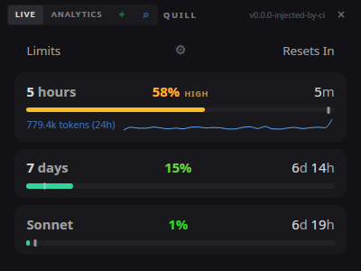
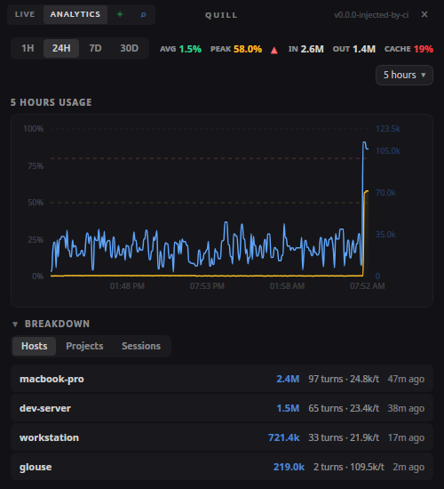
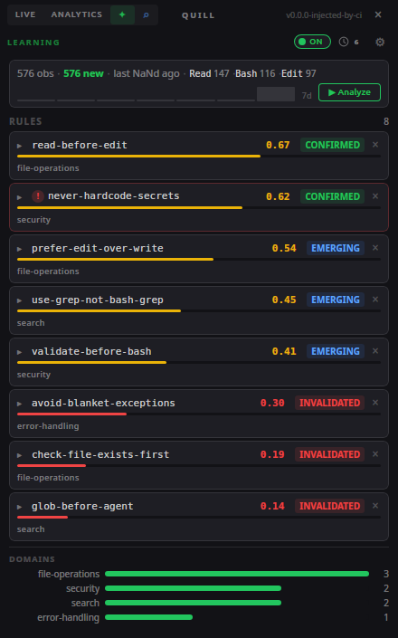
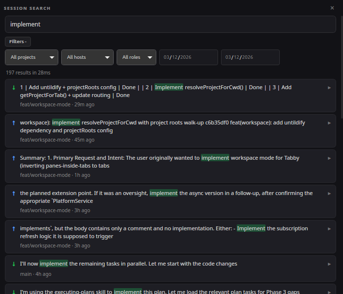
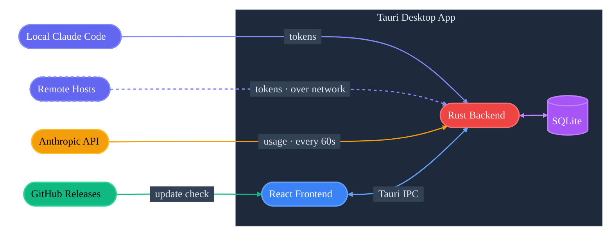

# Quill

<p align="center">
  
</p>

A cross-platform desktop widget that displays your Claude AI plan usage in a compact, always-on-top floating window. Built with Tauri + React.

## Features

### Live usage
- Per-5-hour and per-7-day usage with progress bars
- Per-model breakdown (Sonnet, Opus, Code, OAuth)
- Color-coded percentages that transition green → yellow → red as usage increases
- Countdown timers showing time until usage resets
- Three time display modes (pace marker, dual bars, background fill)
- Token sparkline showing per-turn token counts over time

### Analytics
- Historical usage charts with dual-axis visualization (utilization + tokens)
- Per-bucket statistics with min/max/average, trend indicators, and sparklines
- **Breakdown panels** — token usage grouped by host, project, or session with per-item data deletion
- Time range selection (1h, 24h, 7d, 30d)

### Session search
- Full-text search across all Claude Code sessions (powered by Tantivy)
- Filter by project, host, role, date range, and git branch
- Snippet highlighting with expandable message context
- Opens in a dedicated search window from the titlebar

### Token tracking
- Per-turn input/output/cache token counts via Claude Code hook
- **Multi-host support** — remote Claude Code instances can report usage over the network
- Token sparkline in the live view and dual-axis chart overlay in analytics

### Learning
- Integrated side panel that shows learned usage rules, observation stats, and analysis history
- Configurable triggers: on-demand, session-end, periodic, or combined
- Rule state tracking (emerging → confirmed → stale → invalidated)
- Domain-grouped rules with confidence scores
- Run history with real-time analysis logs

### Desktop integration
- **System tray** with Show / Always on Top / Check for Update / Quit
- **In-app updater** — checks on startup and every 4 hours; yellow "Update" button appears in the titlebar
- Always-on-top mode (toggleable from tray menu)
- Semi-transparent dark theme with custom drag-to-move titlebar
- Remembers window position and size across restarts
- Auto-refreshes usage every 60 seconds
- Automatically refreshes expired OAuth tokens

## Screenshots

<table>
  <tr>
    <td align="center"><strong>Live usage</strong></td>
    <td align="center"><strong>Analytics</strong></td>
    <td align="center"><strong>Learning</strong></td>
  </tr>
  <tr>
    <td></td>
    <td></td>
    <td></td>
  </tr>
</table>

<p align="center">
  <strong>Session search</strong><br/>
  
</p>

## Architecture



## Prerequisites

- [Claude Code](https://docs.anthropic.com/en/docs/claude-code) installed and logged in (`claude /login`)

### For development

- [Rust](https://rustup.rs/) (stable)
- [Node.js](https://nodejs.org/) 18+
- System dependencies for Tauri (Linux):
  ```bash
  sudo apt install libwebkit2gtk-4.1-dev libappindicator3-dev librsvg2-dev patchelf
  ```

## Installation

### From releases

Download the latest release for your platform from the [Releases](../../releases) page:
- **Linux**: `.deb` (recommended) or `.AppImage`
- **Windows**: `.exe`
- **macOS**: `.dmg`

#### Linux setup

**Debian/Ubuntu (recommended)** — installs the binary, desktop entry, and icons system-wide:

```bash
sudo dpkg -i Quill_*_linux_amd64.deb
```

**AppImage** — portable executable, no installation required:

```bash
chmod +x Quill_*_linux_amd64.AppImage
./Quill_*_linux_amd64.AppImage
```

#### Linux uninstall

To fully remove Quill and its data:

```bash
# If installed via .deb:
sudo dpkg -r quill

# If using AppImage:
rm -f ~/Applications/Quill_*_linux_amd64.AppImage

# Remove app data (usage database, auth secret, logs, etc.)
rm -rf ~/.local/share/io.quill.toolkit

# Remove hook config
rm -rf ~/.config/quill
```

### From source

```bash
git clone https://github.com/sharaf-nassar/quill.git
cd quill
npm install
cargo tauri build
```

The built binary will be in `src-tauri/target/release/`.

## Setup

The widget reads OAuth tokens from Claude Code's credentials file (`~/.claude/.credentials.json`). Make sure you are logged in:

```bash
claude /login
```

No additional configuration is needed — the widget starts tracking utilization immediately.

## Token Tracking, Learning & Session Search (Optional)

The widget includes an HTTP server (port `19876`, configurable via `QUILL_PORT`) that receives data from Claude Code via hooks. The plugin enables three features:

- **Token tracking** — per-turn input/output/cache token counts, powering the sparkline in the live view and the token overlay on the analytics chart
- **Learning** — observes tool usage patterns across sessions and can analyze them to extract reusable rules (stored in `~/.claude/rules/learned/`)
- **Session search** — indexes Claude Code session transcripts for full-text search with filters

The HTTP server uses bearer-token authentication and rate limiting to secure incoming data.

### Install the hook (Claude Code plugin)

1. Add the marketplace:

```
/plugin marketplace add sharaf-nassar/quill
```

2. Install the plugin:

```
/plugin install quill-hook@sharaf-nassar/quill
```

3. **Restart** Claude Code, then run the setup skill:

```
/quill-hook:setup
```

The setup skill will ask where the widget is running (this machine or a remote IP) and save the config. After setup, every Claude Code turn will report token counts and tool observations to the widget.

### Using the learning panel

Once the plugin is installed and observations are being collected:

1. Click the **✦ button** in the titlebar to open the learning panel
2. Toggle learning **ON** with the switch in the panel header
3. Choose a trigger mode:
   - **On-demand** — click "Analyze" in the panel to run analysis manually
   - **Session-end** — automatically analyzes after each Claude Code session ends
   - **Periodic** — runs analysis on a configurable interval
   - **Combined** — both session-end and periodic enabled together
4. Analysis extracts patterns from observations and creates rule files in `~/.claude/rules/learned/`
5. Learned rules appear as cards in the panel with confidence scores and domain tags

You can also trigger analysis from Claude Code by running the learn skill:

```
/quill-hook:learn
```

### Manual install (alternative)

```bash
curl -fsSL https://raw.githubusercontent.com/sharaf-nassar/quill/main/hooks/install.sh | bash
```

With a remote widget host:

```bash
curl -fsSL https://raw.githubusercontent.com/sharaf-nassar/quill/main/hooks/install.sh | bash -s -- --url http://<widget-ip>:19876 --hostname my-server
```

### Multi-host setup

Multiple machines can report to a single widget. Install the plugin on each machine and point them to the same widget IP during setup. Each machine's hostname appears in the widget for filtering.

### Verify

```bash
# Check the server is running
curl http://localhost:19876/api/v1/health

# Send a test payload
curl -X POST http://localhost:19876/api/v1/tokens \
  -H 'Content-Type: application/json' \
  -d '{"session_id":"test","hostname":"dev","input_tokens":100,"output_tokens":50,"cache_creation_input_tokens":10,"cache_read_input_tokens":5}'
```

## Development

```bash
npm install
cargo tauri dev
```

## Controls

- **Drag the title bar** to move the window
- **Drag any edge or corner** to resize
- **Gear icon** to switch between time display modes
- **Chart icon** to toggle the analytics view
- **Star button (✦)** to toggle the learning panel — the window expands rightward to show it and shrinks back when closed
- **Search icon** to open the session search window
- **System tray icon** — left-click to show the widget; menu has Always on Top, Check for Update, and Quit

## Project structure

```
src/                          # React frontend
  main.tsx                    # Entry point
  App.tsx                     # Main app component with learning sidebar
  types.ts                    # Shared TypeScript interfaces
  components/
    TitleBar.tsx              # Custom titlebar (drag, view toggles, search, update)
    SectionHeader.tsx         # Reusable collapsible section header
    UsageRow.tsx              # Usage row with progress bar + token sparkline
    UsageDisplay.tsx          # Container for all usage rows
    analytics/
      AnalyticsView.tsx       # Analytics tab with charts, stats, and breakdowns
      BreakdownPanel.tsx      # Host/project/session breakdown with deletion
      UsageChart.tsx          # Dual-axis chart (utilization + tokens)
      shared.tsx              # Shared analytics utilities
    learning/
      StatusStrip.tsx         # Observation stats and sparkline
      RuleCard.tsx            # Individual learned rule display
      DomainBreakdown.tsx     # Rules grouped by domain
      RunHistory.tsx          # Past analysis run log
      FloatingRunsWindow.tsx  # Floating window for run history with live logs
    sessions/
      SearchBar.tsx           # Full-text search input with debounce
      FilterBar.tsx           # Collapsible filters (project, host, role, date)
      ResultCard.tsx          # Search result with expandable context
  windows/
    LearningWindow.tsx        # Learning panel (integrated sidebar)
    RunsWindowView.tsx        # Standalone run history window
    SessionsWindowView.tsx    # Session search window
  hooks/
    useAnalyticsData.ts       # Fetches utilization history and stats
    useBreakdownData.ts       # Fetches host/project/session breakdowns
    useTokenData.ts           # Fetches token history, stats, hostnames
    useLearningData.ts        # Fetches learning rules, runs, observations
    useToast.tsx              # Toast notification system
  utils/
    time.ts                   # Relative time formatting
    tokens.ts                 # Token count formatting (1.2k, 1.5M)
  styles/
    index.css                 # Global styles + dark theme
    learning.css              # Learning panel styles
    sessions.css              # Session search styles
src-tauri/                    # Rust backend
  src/
    main.rs                   # Tauri entry point
    lib.rs                    # IPC commands, tray icon, updater, server startup
    ai_client.rs              # Rig Anthropic integration for learning analysis
    auth.rs                   # OAuth token management
    config.rs                 # Credential loading and token refresh
    fetcher.rs                # Usage API calls with retry logic
    learning.rs               # Learning analysis spawner
    models.rs                 # Data models (usage buckets + token + learning types)
    sessions.rs               # Tantivy full-text session search and indexing
    storage.rs                # SQLite storage with aggregation
    server.rs                 # axum HTTP server for token reporting
  tauri.conf.json             # Tauri window and build configuration
plugin/                       # Claude Code plugin (hook + setup/learn skills)
  .claude-plugin/
    plugin.json               # Plugin manifest
  hooks/
    hooks.json                # PreToolUse, PostToolUse, and Stop hook config
  scripts/
    observe.js                # Captures tool observations (pre/post tool use)
    report-tokens.sh          # Extracts tokens from transcript, POSTs to widget
    session-sync.js           # Syncs session metadata and messages to widget
    session-end-learn.js      # Triggers learning analysis on session end
  skills/
    setup/
      SKILL.md                # Interactive setup wizard
    learn/
      SKILL.md                # Manual learning analysis trigger
  commands/
    setup.md                  # Setup command documentation
    learn.md                  # Learn command documentation
hooks/                        # Standalone hook scripts (non-plugin)
  quill-hook.sh               # Standalone Stop hook
  install.sh                  # curl-pipe installer
```

## Releasing

Releases are driven by git tags. The CI workflow (`.github/workflows/release.yml`) builds and publishes automatically.

1. Create and push a version tag:
   ```bash
   git tag v0.3.0
   git push origin v0.3.0
   ```

2. The `tauri-action` patches the version in `tauri.conf.json` at build time using the tag, so the built binary always matches the tag version. You do not need to update `tauri.conf.json`, `package.json`, or `Cargo.toml` manually — the git tag is the single source of truth for the release version.

3. The workflow creates a draft GitHub release, builds for all platforms (Linux AppImage + .deb, macOS dmg for Intel + ARM, Windows nsis), then publishes the release.

4. The in-app updater checks the `latest.json` endpoint on GitHub Releases on startup and every 4 hours. When an update is found, a yellow "Update" button appears in the titlebar. Linux uses AppImage so updates install without sudo.

## License

MIT
