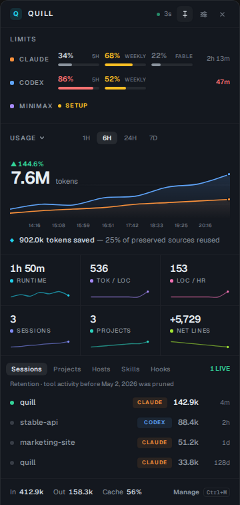
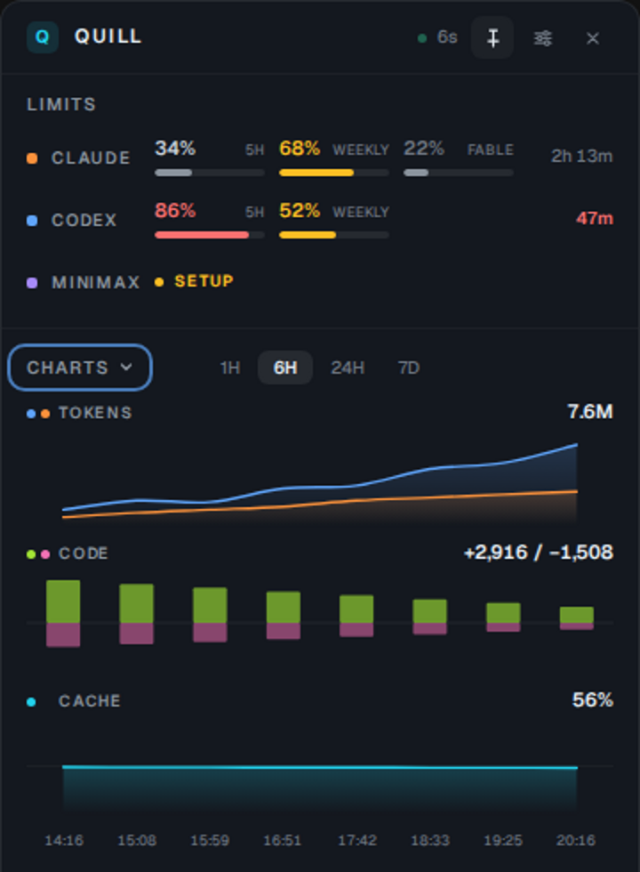
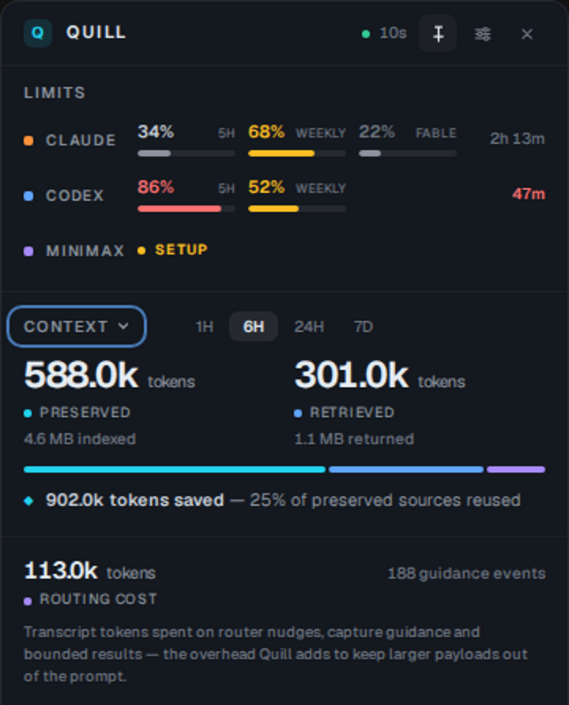

# Quill

<p align="center">
  
</p>

A cross-platform desktop widget that displays your Claude Code, Codex, and other AI assistant usage in a compact, always-on-top floating window — with full-text session search, behavioral learning, and an optional context preservation feature that keeps large working context out of LLM transcripts. Built with Tauri + React.

> Marketing site (live limits, analytics, search, learning): <https://sharaf-nassar.github.io/quill/> · Source under [`marketing-site/`](marketing-site/README.md).

## Features

### Live usage — the LIMITS band
- One always-visible row per enabled provider (Claude, Codex, MiniMax), pinned above everything else in the widget
- One cell per rate-limit window: rounded percentage, compressed window label, and a 4px severity bar
- Severity is reserved for real thresholds — green below 50%, amber from 50%, red from 80%
- A window whose reset has already elapsed renders neutral instead of carrying a bygone utilization as a live alarm
- Right-aligned countdown to each row's nearest upcoming reset
- A provider with no live buckets still states why: `SETUP` when the failure is actionable, `UNAVAILABLE` otherwise
- Degraded reads (offline / paused / showing cached data) surface on the titlebar's sync pill, never as a false severity
- The whole band is absent when no provider is enabled

### Widget views
Everything below LIMITS is one swappable view region. The view name and a shared 1H/6H/24H/7D range strip sit in the region's header, so switching views keeps the selected window. Every chart is drawn by an internal SVG kit — Quill ships no charting dependency.

- **Usage** (default) — a per-provider stacked area chart with the range's total tokens and an in-range momentum delta overlaid, a hover-only legend chip, one computed insight line, a 3×2 readout grid (LLM runtime, tokens per LOC, LOC per hour, sessions, projects, net lines) where each metric carries its own sparkline, a switchable breakdown (Sessions, Projects, Hosts, Skills, Hooks), and an In / Out / Cache footer
- **Trends** — three week-over-week rows (tokens, velocity, cache efficiency) with a delta and paired mini-bars each; fixed to the last seven days against the seven before them, so the view declares itself unranged rather than offering a control that would do nothing
- **Charts** — token flow, code changes, and cache efficiency stacked on one time axis under one shared crosshair, so the three can be read against each other
- **Models** — a running-now strip per provider plus the session-ranked model list; raw model ids exactly as observed, qualified by a provider swatch, with attributed tokens beside each
- **Context** — preserved and retrieved token totals with a split bar, the shared cache-savings line, and the routing cost
- Honesty disclosures keep the home that matches their data: the Hooks breakdown carries the Claude/Codex tracking-asymmetry note, and a condensed retention line appears wherever pruning affects what is drawn

### Manage workspace
- One rail-navigated window for everything that is not live monitoring, opened from the widget titlebar's settings key or the ⌘M / Ctrl+M accelerator
- Four sections — **Sessions** (search), **Learning** (rules, memory, runs), **Instances** (restart), and **Settings**
- ⌘K / Ctrl+K opens a command palette over the sections plus Back-to-Live and Close-Tools actions
- **Settings** tabs: General, Integrations, Context, Learning, and Performance

### Session search
- Full-text search across all Claude Code and Codex sessions (powered by Tantivy)
- Filter by provider, project, host, role, and date range; sort by relevance or recency
- Snippet highlighting with expandable message context and a session detail panel
- Lives in the **Sessions** section of the Manage workspace

### Token tracking
- Per-turn input/output/cache token counts via the bundled Claude Code and Codex hooks
- Feeds the Usage view's provider chart, the readout sparklines, and the In / Out / Cache footer

### Learning
- The Manage workspace's **Learning** section shows learned usage rules, observation stats, and analysis history
- Trigger modes: on-demand, or periodic once enough new observations have accumulated
- Rule lifecycle tracking (candidate → awaiting review → active, plus rejected, suppressed, superseded, and conflict-flagged states)
- Domain-grouped rules with confidence scores
- Run history with real-time analysis logs, opened as a docked panel beside the rules
- Git history integration for cross-source pattern synthesis

### Memory optimizer
- Scans your Claude Code memory files and suggests improvements (merge duplicates, update stale content, remove obsolete entries)
- Approval-based workflow — review each suggestion with a diff preview before applying
- Undo any applied change to restore the original file
- Batched "optimize all" to review and apply suggestions across an entire project
- Optional **Compress prose** pre-pass — rewrites every eligible memory file in caveman style via Anthropic Haiku before the optimizer runs. Skips instruction files, files over 500 KB, files on the secrets denylist, and files that already have an `.original.md` backup. Validates that headings, code blocks, URLs, file paths, and bullets are preserved; on failure restores the original. Successful rewrites leave a `<file>.original.md` backup next to the compressed file so the change is reversible.

### Brevity profile
- Toggled from **Settings → Context** in the Manage workspace, and applied to whichever providers (Claude Code, Codex) are enabled
- Injects a managed "Quill Brevity Profile" instruction block into the provider's primary agent file (`~/.claude/CLAUDE.md` for Claude Code, `~/.codex/AGENTS.md` for Codex), asking the assistant to write in a compressed caveman style for its own prose responses while preserving code blocks, file paths, URLs, library names, command names, numbers, env vars, and markdown structure exactly
- Symlink-aware — when `AGENTS.md` is a symlink to `CLAUDE.md`, only one block is written so the same instructions are not duplicated
- Toggling off strips just the managed block; the rest of the agent file is left untouched
- MiniMax does not have a managed agent file, so brevity is unavailable for it

### Working context preservation
- Optional, default-off feature toggled from **Settings → Context** — keeps large transient context (web pages, file reads, command output, search results) out of the LLM transcript by routing it through a local searchable store
- **Context MCP tools** — when enabled, installs `quill_index_context`, `quill_search_context`, `quill_get_context_source`, `quill_execute` / `quill_execute_file` / `quill_batch_execute`, `quill_fetch_and_index`, `quill_purge_context`, and `quill_context_stats` so the assistant can store, search, and retrieve focused chunks instead of dumping content into the conversation
- **Routing hooks** — block raw `WebFetch` and noisy `curl`/`wget` dumps, nudge broad `Bash`/`Read`/`Grep`/build/test output toward `quill_*` tools, and use per-session marker files to avoid repeating guidance
- **Continuity capture** — small task and decision hints recorded across sessions so a new session can resume context without writing to provider memory paths
- **Telemetry** — every preservation event reports compact byte and token estimates to the widget's Context view; large content stays in the local context store and never enters the analytics database
- Toggling the feature deploys or removes context scripts, the context MCP tool, instruction templates, and hooks for currently enabled providers; historical context stores and analytics rows are preserved on disable
- Available for both Claude Code and Codex via their respective integrations

### MCP server
- Gives Claude Code (and Codex) direct access to your indexed session history and — when context preservation is enabled — the working context store
- Session-history tool:
  - **`search_history`** — full-text search across all sessions by content, edits, commands, or tool use (filter by project, git branch, role, date)
- Context tools (only when context preservation is enabled): see the Working context preservation section above
- Automatically configured when the app starts — no manual setup needed

### Restart orchestrator
- Monitor and restart Claude Code instances from within Quill
- Detects terminal type (Tmux, Plain) and tracks instance status
- Lives in the **Instances** section of the Manage workspace

### Code stats
- Lines of code added/removed tracked per session, grouped by language
- Net lines, tokens per LOC, and LOC per hour sit in the Usage view's readout grid, each with its own sparkline
- The code-changes timeline shares the Charts view's axis and crosshair, and velocity is one of the Trends view's week-over-week rows

### Desktop integration
- **System tray** with Show Widget / Always on Top / Check for Update / Quit
- **In-app updater** — checks on startup and every 4 hours; a cyan "Update" button then appears centered in the widget titlebar
- Always-on-top toggle in the widget titlebar, sharing one persisted setting with the tray checkitem and Settings
- Frameless, transparent, near-black flat surface with a drag-to-move titlebar
- Fixed 360px width with a content-derived height (clamped to 200–900px); window position is remembered across restarts, size is deliberately not stored
- Closing from the titlebar hides the widget to the tray rather than quitting
- Refreshes usage every 3 minutes while the widget is open; an optional background refresh (60–600s, Settings → Performance) keeps the tray indicator current while it is hidden
- Read-only OAuth — reads Claude Code's token, never refreshes it
- **Zoom controls** — Ctrl+/- to zoom, Ctrl+0 to reset, persisted per window

## Screenshots

The main window is a 360px always-on-top widget: a LIMITS band that never
leaves the frame, and one view below it that the header's dropdown swaps.

<table>
  <tr>
    <td align="center"><strong>Usage</strong></td>
    <td align="center"><strong>Charts</strong></td>
    <td align="center"><strong>Context</strong></td>
  </tr>
  <tr>
    <td valign="top"></td>
    <td valign="top"></td>
    <td valign="top"></td>
  </tr>
</table>

Learning, session search, instances, and settings live in the Manage workspace
(⌘M / Ctrl+M); their shots are captured by `scripts/take_screenshots.sh`.

## Architecture


```mermaid
%%{init: {'theme': 'base', 'themeVariables': {
  'primaryColor': '#1e293b',
  'primaryTextColor': '#e2e8f0',
  'lineColor': '#94a3b8',
  'secondaryColor': '#334155',
  'tertiaryColor': '#0f172a',
  'fontFamily': 'ui-sans-serif, system-ui, sans-serif',
  'fontSize': '14px',
  'edgeLabelBackground': '#1e293b'
}}}%%

graph TB
    subgraph Sources [" Claude Code Integration "]
        CC(["Claude Code"])
        BH(["Bundled Hooks"])
        MS(["MCP Server"])
    end

    subgraph Widget [" Quill · Tauri Desktop App "]
        FE(["React Frontend"])
        BE(["Rust Backend"])
        DB[(SQLite)]
        FTS[(Tantivy)]
    end

    API(["Anthropic API"])
    GH(["GitHub Releases"])

    CC -- hooks --> BH
    CC <-->|protocol| MS

    BH -- "tokens · sessions" --> BE
    MS -- queries --> BE

    FE <-->|Tauri IPC| BE
    BE <--> DB
    BE <--> FTS

    API -- "usage data" --> BE
    BE -. "LLM analysis" .-> API
    GH -- "update check" --> FE

    style CC fill:#6366f1,stroke:#818cf8,color:#fff,stroke-width:2px
    style BH fill:#6366f1,stroke:#818cf8,color:#fff,stroke-width:2px
    style MS fill:#6366f1,stroke:#818cf8,color:#fff,stroke-width:2px
    style FE fill:#3b82f6,stroke:#60a5fa,color:#fff,stroke-width:2px
    style BE fill:#3b82f6,stroke:#60a5fa,color:#fff,stroke-width:2px
    style DB fill:#8b5cf6,stroke:#a78bfa,color:#fff,stroke-width:2px
    style FTS fill:#8b5cf6,stroke:#a78bfa,color:#fff,stroke-width:2px
    style API fill:#f59e0b,stroke:#fbbf24,color:#000,stroke-width:2px
    style GH fill:#f59e0b,stroke:#fbbf24,color:#000,stroke-width:2px
    style Sources fill:#0f172a,stroke:#334155,color:#94a3b8
    style Widget fill:#0f172a,stroke:#475569,color:#e2e8f0
```

## Prerequisites

- [Claude Code](https://docs.anthropic.com/en/docs/claude-code) installed and logged in (`claude /login`)

### For development

- [Rust](https://rustup.rs/) (stable)
- [Node.js](https://nodejs.org/) 18+
- System dependencies for Tauri (Linux):
  ```bash
  sudo apt install libwebkit2gtk-4.1-dev libappindicator3-dev librsvg2-dev patchelf
  ```

## Installation

### From releases

Download the latest release for your platform from the [Releases](../../releases) page:
- **Linux**: `.AppImage`
- **Windows**: `.exe`
- **macOS**: `.dmg`

#### Linux setup

**Quick install (recommended)** — fetches the latest AppImage, makes it
executable, installs it to `~/Applications`, and launches it:

```bash
curl -fsSL https://raw.githubusercontent.com/sharaf-nassar/quill/main/install.sh | sh
```

**Manual** — the AppImage is a portable executable, but browsers save downloads
non-executable, so mark it runnable first (it is the only Linux build, and the
only format the in-app updater can self-update):

```bash
chmod +x Quill_*_linux_amd64.AppImage
./Quill_*_linux_amd64.AppImage
```

On first launch Quill offers to add itself to your applications menu (with an icon) — no manual `.desktop` setup needed. You can re-run this anytime from **Settings → General → "Install to applications menu"**. Once added, Quill auto-updates in place.

> Quill no longer ships a `.deb`: Debian installs can't use the in-app updater
> (Tauri only self-updates AppImages), so they were stranded on whatever version
> was installed. If you previously installed the `.deb`, remove it (see below)
> and switch to the AppImage to get automatic updates.

#### Linux uninstall

To fully remove Quill and its data:

```bash
# If installed via .deb:
sudo dpkg -r quill

# If using AppImage:
rm -f ~/Applications/Quill_*_linux_amd64.AppImage

# Remove app data (usage database, auth secret, logs, etc.)
# macOS:
rm -rf ~/Library/Application\ Support/com.quilltoolkit.app
# Linux:
rm -rf ~/.local/share/com.quilltoolkit.app

# Remove hook scripts, MCP server, and config
rm -rf ~/.config/quill

# Remove Claude Code integration added by the app
# (hooks in ~/.claude/settings.json with _source: "quill-setup",
#  MCP entry in ~/.claude.json, and CLAUDE.md section are left in place
#  — remove manually if desired)
```

### From source

```bash
git clone https://github.com/sharaf-nassar/quill.git
cd quill
npm install
cargo tauri build
```

The built binary will be in `src-tauri/target/release/`.

## Setup

The widget reads OAuth tokens from Claude Code's credentials file (`~/.claude/.credentials.json`). Make sure you are logged in:

```bash
claude /login
```

No additional configuration is needed — the widget starts tracking utilization immediately.

### Enabling context preservation (optional)

Open the Manage workspace (⌘M / Ctrl+M, or the settings key in the widget titlebar) and toggle **Working Context Preservation** in **Settings → Context**. Enabling installs the context MCP tool, routing hooks, and capture scripts for currently active providers (Claude Code, Codex). Disabling redeploys the base integration and removes context assets while preserving historical context stores and analytics rows. The widget's **Context** view then reports what the store kept out of the transcript, what came back, and what routing cost.

## Token Tracking, Learning & Session Search

The app includes an HTTP server (port `19876`, configurable via `QUILL_PORT`) that receives data from Claude Code via hooks. This powers three features:

- **Token tracking** — per-turn input/output/cache token counts, powering the Usage view's provider chart, its readout sparklines, and the In / Out / Cache footer
- **Learning** — observes tool usage patterns across sessions and can analyze them to extract reusable rules (stored in `~/.claude/rules/learned/`)
- **Session search** — indexes Claude Code session transcripts for full-text search with filters

The HTTP server uses bearer-token authentication and rate limiting to secure incoming data.

### Local setup (automatic)

When the Quill app runs on the same machine as Claude Code, **everything is configured automatically** on app startup — no manual steps required. The app:

1. Deploys hook scripts to `~/.config/quill/scripts/`
2. Deploys the MCP server to `~/.config/quill/mcp/`
3. Registers hooks in `~/.claude/settings.json`
4. Registers the MCP server in `~/.claude.json`
5. Writes connection config to `~/.config/quill/config.json`
6. Adds MCP usage instructions to `~/.claude/CLAUDE.md`

Just install the app, launch it, and restart Claude Code. Token tracking, learning, session search, and MCP tools will all be active.

### Using the Learning section

Once observations are being collected:

1. Open the Manage workspace (⌘M / Ctrl+M, or the settings key in the widget titlebar) and select **Learning**
2. Toggle learning **ON** with the switch in the section header
3. Choose a trigger mode:
   - **On-demand** — click "Analyze" in the status strip to run analysis manually
   - **Periodic** — runs on a configurable interval once enough new observations have accumulated
4. Analysis extracts patterns from observations and creates rule files in `~/.claude/rules/learned/`
5. Learned rules appear as cards under **Rules** with confidence scores and domain tags; **Runs** docks the analysis history beside them

### Verify

```bash
# Check the server is running
curl http://localhost:19876/api/v1/health

# Send a test payload
curl -X POST http://localhost:19876/api/v1/tokens \
  -H 'Content-Type: application/json' \
  -d '{"session_id":"test","hostname":"dev","input_tokens":100,"output_tokens":50,"cache_creation_input_tokens":10,"cache_read_input_tokens":5}'
```

## Development

```bash
npm install
cargo tauri dev
```

## Controls

- **Drag the titlebar** to move the widget — the width is fixed at 360px and the height follows the content, so there is nothing to resize
- **Pin key** in the titlebar toggles always-on-top
- **Settings key** in the titlebar opens the Manage workspace at its Settings section
- **Close key** in the titlebar hides the widget to the tray; Quill keeps running
- **View name** below LIMITS opens the view list — Usage, Trends, Charts, Models, Context
- **1H / 6H / 24H / 7D** re-scopes every band of the active view at once
- **⌘M / Ctrl+M**, or the Manage button in the Usage footer, opens the Manage workspace
- **⌘K / Ctrl+K** inside Manage opens the command palette
- **Right-click the widget** for Refresh and Quit
- **System tray menu** — Show Widget, Always on Top, Check for Update, and Quit
- **Ctrl+/- (or Cmd+/-)** to zoom and **Ctrl+0** to reset, remembered per window

## Project structure

```
src/                          # React frontend
  main.tsx                    # Window routing, per-window zoom, ⌘M accelerator
  App.tsx                     # The 360px widget shell (polling, updater, close-to-tray, height)
  types.ts                    # Shared TypeScript interfaces
  components/
    widget/
      WidgetTitleBar.tsx      # Brand, update button, sync pill, pin/settings/close keys
      LimitsSection.tsx       # LIMITS band: one row per enabled provider
      ViewRegion.tsx          # View + range header; hosts the active view
      ViewSwitcher.tsx        # Listbox that swaps the view region
      views/
        UsageView.tsx         # Chart, insight line, readout grid, breakdown, totals footer
        TrendsView.tsx        # Week-over-week tokens, velocity, cache efficiency
        ChartsView.tsx        # Three series on one axis under one crosshair
        ModelsView.tsx        # Running-now strip + session-ranked model list
        ContextView.tsx       # Preserved/retrieved totals and routing cost
        insightLine.ts        # Priority rule behind the Usage insight line
      viz/                    # Internal SVG kit (AreaChart, Sparkline, Bars, geometry)
    settings/                 # General, Integrations, Context, Learning, Performance tabs
    learning/                 # Status strip, rule cards, memory optimizer, run history
    sessions/                 # Search bar, filters, result cards, detail panel
    restart/RestartPanel.tsx  # Claude Code instance restart panel
    CommandPalette.tsx        # Manage's ⌘K section navigator
    ConfirmDialog.tsx         # Shared confirmation modal
    RetentionBanner.tsx       # Retention degradation disclosure
  windows/
    ManageWindowView.tsx      # Rail-navigated Manage workspace hosting the four sections
    SessionsWindowView.tsx    # Sessions section (session search)
    LearningWindow.tsx        # Learning section (Rules / Memory / Runs)
    RestartWindowView.tsx     # Instances section
    SettingsWindowView.tsx    # Settings section
    ReleaseNotesWindow.tsx    # Release notes viewer window
  hooks/                      # IPC data hooks
    useWidgetSeries.ts        # Provider token series and activity series for the widget
    useBreakdownData.ts       # Session/project/host/skill/hook breakdowns
    useWeeklyTrends.ts        # Week-over-week figures behind the Trends view
    useCodeInsights.ts        # Tokens per LOC, LOC per hour, net lines
    useLlmRuntimeStats.ts     # Active LLM runtime and its sparkline
    useModelAnalytics.ts      # Model attribution behind the Models view
    useContextSavingsStats.ts # Context preservation telemetry aggregates
    useLearningData.ts        # Learning rules, runs, observations
    useMemoryData.ts          # Memory files, optimization runs, suggestions
    useIntegrations.ts        # Provider detection, enablement, and feature toggles
    useRuntimeSettings.ts     # Persisted runtime settings (always-on-top, polling, …)
  lib/
    manageWindow.ts           # Single entry point that focuses or creates Manage
    crashReporting.ts         # Opt-in crash reporting
  mocks/                      # Browser-mode IPC fixtures (dev only, no Tauri runtime)
  utils/                      # Time, token, provider, retention, and format helpers
  styles/
    index.css                 # Global styles, widget tokens, and every widget band
    manage.css                # Manage workspace chrome and section embedding
    settings.css              # Settings tab styles
    learning.css              # Learning section styles
    sessions.css              # Session search styles
    restart.css               # Instance restart styles
src-tauri/                    # Rust backend
  src/
    main.rs                   # Tauri entry point
    lib.rs                    # IPC commands, tray icon, updater, server startup
    integrations/             # Provider detection, deployment, and manifests
      claude.rs, codex.rs, minimax.rs, deploy.rs, manager.rs, manifest.rs
    claude_setup.rs           # Auto-configures Claude Code on app startup (hooks, MCP, config)
    auth.rs                   # OAuth token management
    config.rs                 # Credential loading (read-only) and the shared HTTP client
    fetcher.rs                # Usage API calls
    cc_client.rs              # Claude Code subprocess surface for inference calls
    indicator.rs              # Tray indicator summary state
    storage.rs                # SQLite storage with aggregation
    models.rs                 # Data models (usage buckets, tokens, learning types)
    model_usage.rs            # Model attribution behind the Models view
    sessions.rs               # Tantivy full-text session search and indexing
    transcript_analytics.rs   # Analytics snapshots parsed from retained transcripts
    transcript_identity.rs    # Provider-native transcript identity resolution
    server.rs                 # axum HTTP server for token reporting
    learning.rs               # Learning analysis spawner
    git_analysis.rs           # Git history analysis for learning
    memory_optimizer.rs       # Memory file scanning, LLM analysis, suggestion execution
    compress_prose.rs         # Caveman pre-pass (detect / prompt / validate submodules)
    brevity.rs                # Managed brevity block in provider agent files
    context_category.rs       # Context-savings event taxonomy
    retention*.rs             # Retention policy, test fixture, and pruning engine
    restart.rs                # Claude Code instance restart management
    releases.rs               # GitHub release notes
    appimage_integration.rs   # Linux applications-menu install
    crash_reporting.rs        # Opt-in crash report plumbing
  claude-integration/         # Resources bundled into the app for local Claude Code setup
    scripts/                  # Hook scripts deployed to ~/.config/quill/scripts/
      observe.cjs             # Captures tool observations (pre/post tool use)
      report-tokens.sh        # Extracts tokens from transcript, POSTs to widget
      session-sync.cjs        # Syncs session metadata and messages to widget
      context-capture.cjs     # Records continuity events, snapshots, and capture telemetry
      context-router.cjs      # Routes broad tool calls toward quill_* MCP tools (when enabled)
      context-telemetry.cjs   # Builds and posts context-savings events to the widget
    templates/                # Managed CLAUDE.md instruction blocks
    mcp/                      # MCP server deployed to ~/.config/quill/mcp/
      server.py               # FastMCP server for session history (and context) tools
      dependencies.py         # Lifespan and shared state
      tools/
        search.py             # search_history
        context.py            # quill_index_context, quill_search_context, quill_execute, fetch_and_index, etc.
  codex-integration/          # Parallel resources for Codex CLI (scripts, templates, hook observer)
  tauri.conf.json             # Tauri window and build configuration
```

## Releasing

Releases are driven by git tags via `release.sh`. The CI workflow (`.github/workflows/release.yml`) builds and publishes automatically.

```bash
./release.sh bump patch    # v0.3.1 -> v0.3.2
./release.sh bump minor    # v0.3.1 -> v0.4.0
./release.sh retag          # Re-point latest tag to current HEAD
./release.sh latest         # Show current version
```

`bump` and `retag` generate user-facing release notes via Claude, commit them as `release_notes.md`, then tag and push. The CI picks up the notes and applies them to the GitHub release.

The `tauri-action` patches the version in `tauri.conf.json` at build time using the tag — you do not need to update version numbers manually. The workflow builds for all platforms (Linux AppImage, macOS dmg for Intel + ARM, Windows nsis), then publishes the release.

The in-app updater checks `latest.json` on GitHub Releases on startup and every 4 hours. When an update is found, a cyan "Update" button appears centered in the widget titlebar.

## License

MIT
