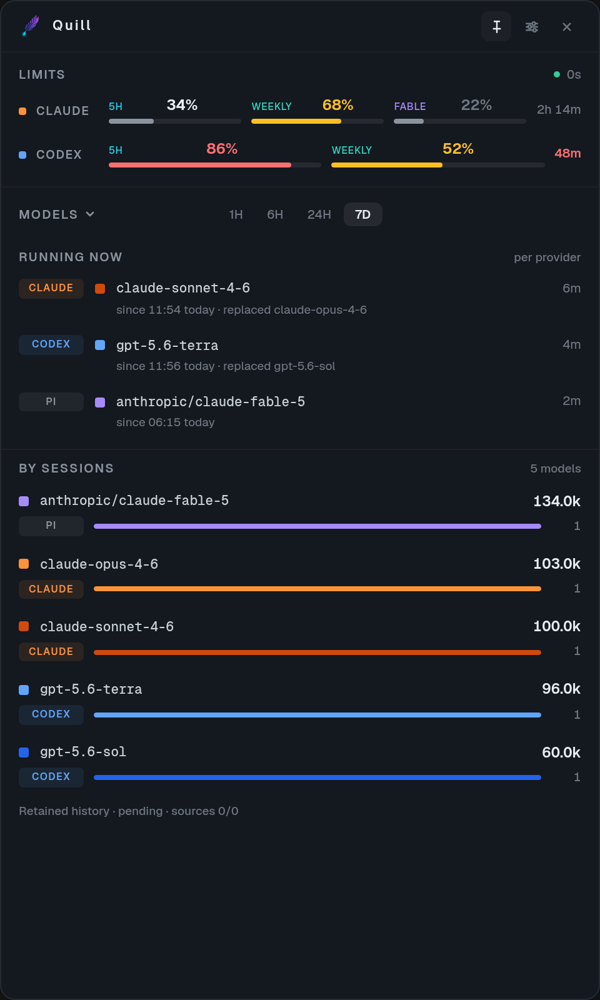
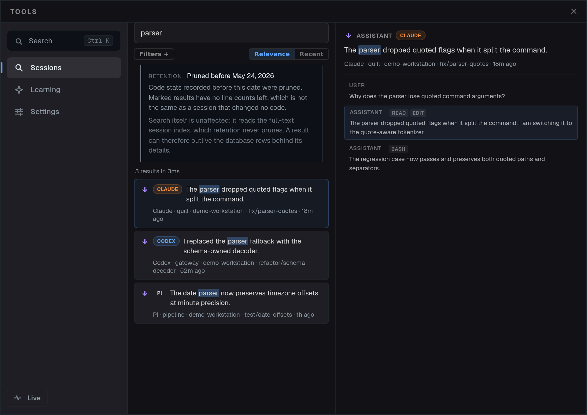
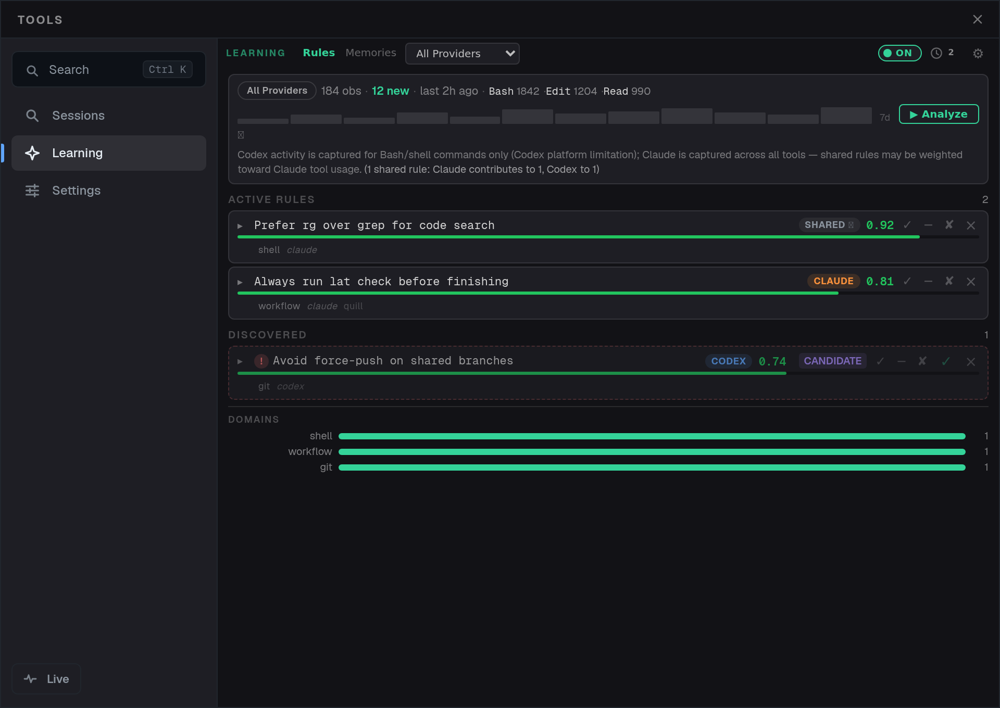
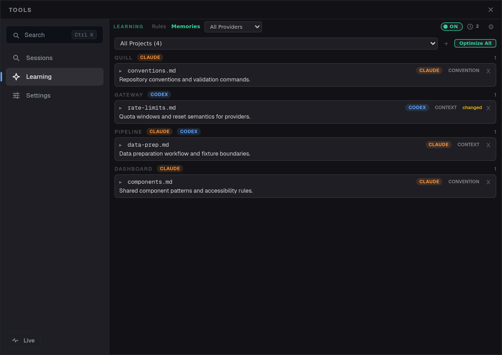
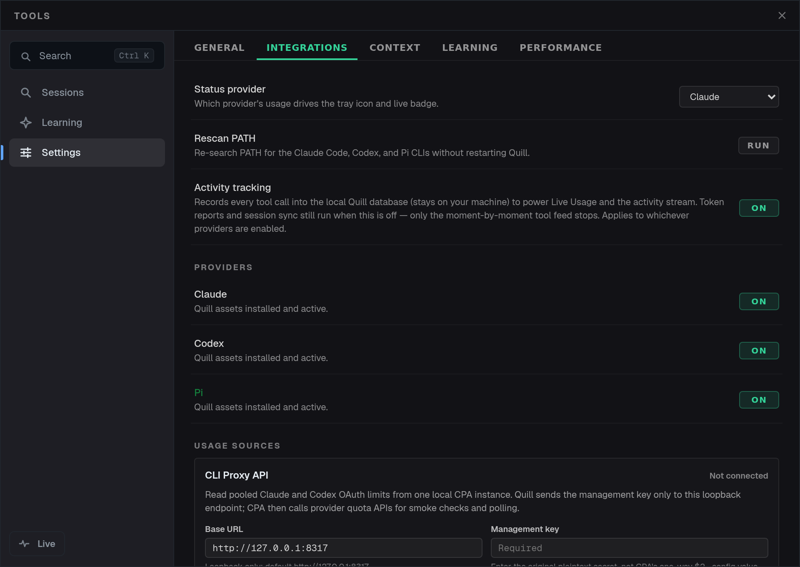
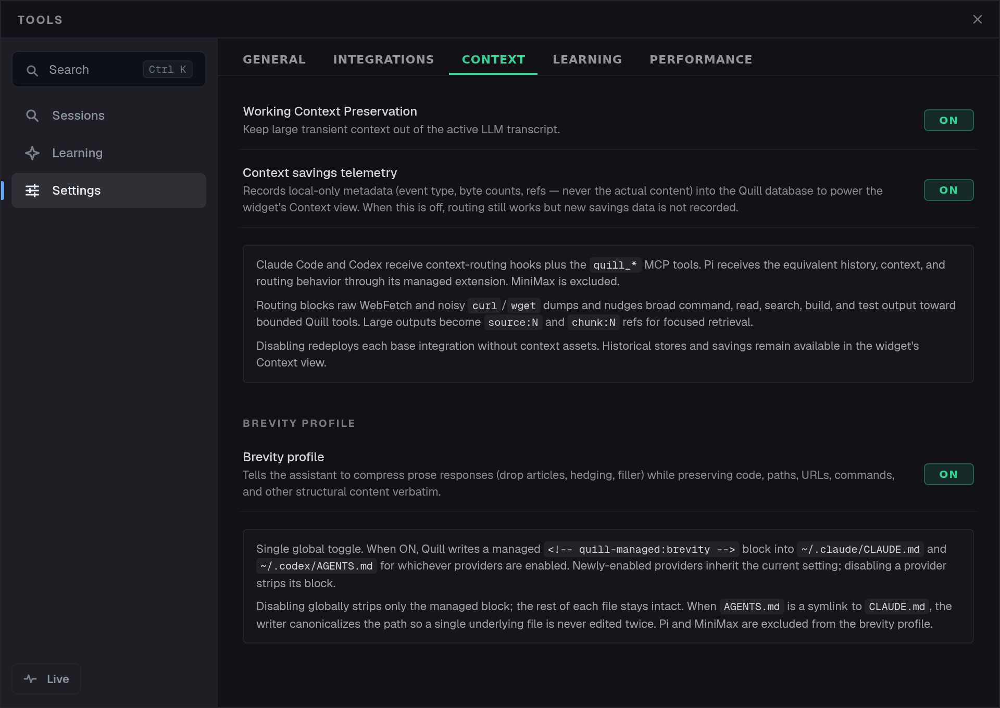
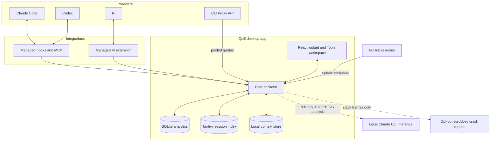

# Quill

<p align="center">
  
</p>

A cross-platform desktop companion for Claude Code, Codex, Pi. It combines usage and model analytics, session search, behavioral learning, memory tools, and optional context preservation in a compact always-on-top widget plus a consolidated Tools workspace. Built with Tauri + React.

> Marketing site: <https://sharaf-nassar.github.io/quill/> · Source under [`marketing-site/`](marketing-site/README.md).

## Features

A one-line tour. Each item links to its full description in [Features in depth](#features-in-depth).

- **[Live usage](#live-usage)** — a LIMITS band pinned above everything else with Claude and Codex utilization windows and reset countdowns; Pi contributes analytics but has no quota row
- **[Widget views](#widget-views)** — Usage, Models, and Context swap in one region under a shared 1H/6H/24H/7D range strip; widget graphics use an internal SVG kit, so Quill ships no charting dependency
- **[Agent visibility](#agent-visibility)** — session rows separate root-turn runtime, retained agent totals, and the models of agents currently observed working
- **[Multi-account pools](#multi-account-pools)** — connect a local CLI Proxy API instance and LIMITS reports mean pool pressure instead of a single account
- **[Tools workspace](#tools-workspace)** — one rail-navigated window (⌘M / Ctrl+M) holding Sessions, Learning, and Settings
- **[Session search](#session-search)** — Tantivy-backed full-text search across every Claude Code, Codex, and Pi session, with filters and snippet highlighting
- **[Token tracking](#token-tracking)** — per-turn input/output/cache counts from Claude Code, Codex, and Pi evidence
- **[Code stats](#code-stats)** — lines added and removed per session by language, plus tokens per LOC and LOC per hour
- **[Learning](#learning)** — combines tool use, git history, and recent sessions into reviewable rule candidates with evidence scores
- **[Memory optimizer](#memory-optimizer)** — suggests merges, updates, and removals for your memory files; every change is diff-reviewed and undoable
- **[Brevity profile](#brevity-profile)** — a managed instruction block that compresses assistant prose while leaving code, paths, and commands untouched
- **[Working context preservation](#working-context-preservation)** — routes large transient output into a local searchable store instead of the LLM transcript
- **[MCP server](#mcp-server)** — hands Claude Code and Codex `search_history`, plus the context tools when preservation is on
- **[Desktop integration](#desktop-integration)** — tray menu, in-app updater, always-on-top, a frameless resizable window, and per-window zoom
- **[Crash reporting](#crash-reporting)** — default-on and opt-out, sending stack frames with every dynamic field stripped locally first

## Screenshots

The 360px widget keeps LIMITS visible above three switchable views.

<table>
  <tr>
    <td align="center"><strong>Usage</strong></td>
    <td align="center"><strong>Models</strong></td>
    <td align="center"><strong>Context</strong></td>
  </tr>
  <tr>
    <td valign="top"></td>
    <td valign="top"></td>
    <td valign="top"></td>
  </tr>
</table>

Everything else lives in the rail-navigated Tools workspace opened with
⌘M / Ctrl+M.

<table>
  <tr>
    <td align="center"><strong>Session search</strong></td>
    <td align="center"><strong>Learning</strong></td>
    <td align="center"><strong>Memories</strong></td>
  </tr>
  <tr>
    <td valign="top"></td>
    <td valign="top"></td>
    <td valign="top"></td>
  </tr>
</table>

<table>
  <tr>
    <td align="center"><strong>Integrations</strong></td>
    <td align="center"><strong>Context and brevity</strong></td>
  </tr>
  <tr>
    <td valign="top"></td>
    <td valign="top"></td>
  </tr>
</table>

All images come from the deterministic Docker capture workflow described under
[Development](#development). No personal Quill data or desktop session is mounted.

## Architecture


```mermaid
graph TB
    subgraph Providers
        CC[Claude Code]
        CX[Codex]
        PI[Pi]
        CPA[CLI Proxy API]
    end

    subgraph Integrations
        HM[Managed hooks and MCP]
        PE[Managed Pi extension]
    end

    subgraph Quill[Quill desktop app]
        FE[React widget and Tools workspace]
        BE[Rust backend]
        DB[(SQLite analytics)]
        FTS[(Tantivy session index)]
        CTX[(Local context store)]
    end

    CLI[Local Claude CLI inference]
    GH[GitHub releases]
    SENTRY[Opt-out scrubbed crash reports]

    CC <--> HM
    CX <--> HM
    PI <--> PE
    HM --> BE
    PE --> BE
    CPA -- pooled quotas --> BE

    FE <--> BE
    BE <--> DB
    BE <--> FTS
    BE <--> CTX
    BE -. learning and memory analysis .-> CLI
    GH -- update metadata --> BE
    BE -. stack frames only .-> SENTRY
```

## Prerequisites

Quill can run before any provider is enabled. Install whichever local CLIs you
want it to integrate with: Claude Code, Codex, or Pi. MiniMax live limits use an
API key instead of a local CLI.

Behavioral learning and memory optimization run through the local Claude Code
CLI, so those two features require Claude Code to be installed and logged in
with `claude /login`.

### For development

- [Rust](https://rustup.rs/) (stable)
- [Node.js](https://nodejs.org/) 18+
- System dependencies for Tauri (Linux):
  ```bash
  sudo apt install libwebkit2gtk-4.1-dev libappindicator3-dev librsvg2-dev patchelf
  ```

## Installation

### From releases

Download the latest release for your platform from the [Releases](../../releases) page:
- **Linux**: `.AppImage`
- **Windows**: `.exe`
- **macOS**: `.dmg`

#### Linux setup

**Quick install (recommended)** — fetches the latest AppImage, makes it
executable, installs it to `~/Applications`, and launches it:

```bash
curl -fsSL https://raw.githubusercontent.com/sharaf-nassar/quill/main/install.sh | sh
```

**Manual** — the AppImage is a portable executable, but browsers save downloads
non-executable, so mark it runnable first (it is the only Linux build, and the
only format the in-app updater can self-update):

```bash
chmod +x Quill_*_linux_amd64.AppImage
./Quill_*_linux_amd64.AppImage
```

On first launch Quill offers to add itself to your applications menu (with an icon) — no manual `.desktop` setup needed. You can re-run this anytime from **Settings → General → "Install to applications menu"**. Once added, Quill auto-updates in place.

> Quill no longer ships a `.deb`: Debian installs can't use the in-app updater
> (Tauri only self-updates AppImages), so they were stranded on whatever version
> was installed. If you previously installed the `.deb`, remove it (see below)
> and switch to the AppImage to get automatic updates.

#### Linux uninstall

To fully remove Quill and its data:

```bash
# If installed via .deb:
sudo dpkg -r quill

# If using AppImage:
rm -f ~/Applications/Quill_*_linux_amd64.AppImage

# Remove app data (usage database, auth secret, logs, etc.)
# macOS:
rm -rf ~/Library/Application\ Support/com.quilltoolkit.app
# Linux:
rm -rf ~/.local/share/com.quilltoolkit.app

# Remove hook scripts, MCP server, and config
rm -rf ~/.config/quill

# Remove Claude Code integration added by the app
# (hooks in ~/.claude/settings.json with _source: "quill-setup",
#  MCP entry in ~/.claude.json, and CLAUDE.md section are left in place
#  — remove manually if desired)
```

### From source

```bash
git clone https://github.com/sharaf-nassar/quill.git
cd quill
npm install
npm run tauri -- build
```

The built binary will be in `src-tauri/target/release/`.

## Setup

1. Launch Quill and open **Tools → Settings → Integrations**.
2. Enable Claude Code, Codex, or Pi. Quill asks before installing its managed
   hooks, MCP files, or Pi extension.
3. Add a MiniMax API key only if you want MiniMax plan limits.
4. Restart an already-running provider CLI after first enable so it loads the
   new integration files.

Claude live limits use the existing Claude Code OAuth session. If that session
is logged out, run `claude /login`; Quill never refreshes the token itself.

### Enabling context preservation (optional)

Open the Tools workspace (⌘M / Ctrl+M, or the settings key in the widget titlebar) and toggle **Working Context Preservation** in **Settings → Context**. For Claude Code and Codex, enabling installs the context MCP tool, routing hooks, and capture scripts. Pi receives the core history and context tools plus equivalent routing policy through its managed extension. Disabling redeploys the base integrations and removes context assets while preserving historical context stores and analytics rows. The widget's **Context** view then reports what the store kept out of the transcript, what came back, and what routing cost.

### Pi integration

Enable Pi under **Settings → Integrations**. Quill indexes Pi transcripts for
Session Search, follows live sessions, and ingests usage watcher-side from
`AssistantMessage` transcript entries, preserving each recorded upstream model.
It also registers `quill_` history and
working-context tools through Pi's extension API and Quill's local HTTP API.
Pi does not use MCP or external hook commands, and it has no LIMITS row.

## Local data collection

Quill's authenticated local server listens on port `19876` by default
(configurable with `QUILL_PORT`). Enabled integrations report or expose:

- **Claude Code and Codex** — token, tool, hook, and lifecycle telemetry through
  managed local scripts; transcripts remain the retained source for search and
  model analytics
- **Pi** — session lifecycle and usage through its managed extension, with
  transcript indexing for search and model evidence
- **MiniMax** — plan limits only; it has no transcript or learning integration

Enabling Claude Code or Codex deploys the required scripts and MCP files under
`~/.config/quill/`, updates the provider's owned configuration, and writes the
shared local connection contract. Enabling Pi installs one managed extension.
Disabling a provider removes only Quill-owned integration state. All mutations
are explicit and confirmation-gated in **Settings → Integrations**.

The local server uses a generated bearer secret and endpoint rate limits. It is
also the ingestion path for token tracking, live session state, context-savings
telemetry, and observed hooks.

### Using the Learning section

Once observations are being collected:

1. Open Tools with ⌘M / Ctrl+M and select **Learning**.
2. Click **Analyze** for an on-demand run, or configure periodic analysis under
   **Settings → Learning**.
3. Quill combines tool observations, git history, and recent indexed sessions
   into evidence-backed candidates.
4. Review candidates under **Discovered**. Analysis never writes a rule file by
   itself; explicit promotion is the only path to an active `.md` rule.
5. Use the clock button to dock run history, phase results, inference cost, and
   live logs beside the rules.

### Verify

```bash
# Check the server is running
curl http://localhost:19876/api/v1/health

# Send a test payload
curl -X POST http://localhost:19876/api/v1/tokens \
  -H 'Content-Type: application/json' \
  -d '{"session_id":"test","hostname":"dev","input_tokens":100,"output_tokens":50,"cache_creation_input_tokens":10,"cache_read_input_tokens":5}'
```

## Development

```bash
npm install
npm run tauri -- dev
```

This loads `src-tauri/tauri.dev.conf.json`, so a dev run identifies as
`com.quilltoolkit.app.dev` and keeps its database, auth secret, session index,
and single-instance lock separate from an installed Quill. Invoking the Tauri
CLI directly (`cargo tauri dev`) skips that and writes to production state.

A dev run keeps its own database, context store, learned rules, and app caches
(`~/.config/quill-dev/` and its identity-specific data root). Startup repairs
current provider integrations—including Pi—for live validation. Set
`QUILL_DEV_INTEGRATIONS=0` to keep a dev run read-only.

What it does *not* move is the provider handshake: every build listens on
19876/19877 and publishes the same `~/.config/quill/config.json` with the same
auth secret, because a provider resolves one contract from one fixed path and
cannot tell which Quill wrote it. Only one Quill can run at a time — the second
one finds the port taken, says so in a dialog, and quits. Stop the installed app
before `npm run tauri -- dev`. `QUILL_PORT` and `QUILL_CONTEXT_PORT` still
override the ports when you really do want two.

### Refresh documentation screenshots

```bash
./scripts/capture_screenshots_docker.sh
```

This builds the current release binary with the embedded frontend, starts it in
a private Xvfb/Openbox desktop, seeds deterministic fictional data, captures all
widget and Tools views, validates every expected PNG, and only then replaces
`marketing-site/assets/screenshots/`. The container has no host display socket,
personal home directory, Quill data directory, or published network port.

The first build downloads the Linux/Tauri toolchain. Later runs reuse Docker and
Cargo caches.

## Controls

- **Drag the titlebar** to move the widget; **drag any edge or corner** to resize it (floor 320×200, no ceiling) — both position and size are remembered
- **Pin key** in the titlebar toggles always-on-top
- **Settings key** in the titlebar opens the Tools workspace at its Settings section
- **Close key** in the titlebar hides the widget to the tray; Quill keeps running
- **View name** below LIMITS opens the view list — Usage, Models, Context
- **1H / 6H / 24H / 7D** re-scopes every band of the active view at once
- **⌘M / Ctrl+M**, or the Manage button in the Usage footer, opens the Tools workspace
- **⌘K / Ctrl+K** inside Tools opens the command palette
- **Right-click the widget** for Refresh and Quit
- **System tray menu** — Show Widget, Always on Top, Check for Update, and Quit
- **Ctrl+/- (or Cmd+/-)** to zoom and **Ctrl+0** to reset, remembered per window

## Features in depth

Every entry in the [Features](#features) list above, in full.

### Live usage

The LIMITS band is the one region that never scrolls away — provider rate-limit
pressure, read as an instrument.

- One identity row per enabled provider (Claude, Codex, MiniMax); the whole band is absent when no provider is enabled
- One cell per rate-limit window: rounded percentage, compressed window label, and a 4px severity bar. Cells divide the row's meter region evenly and reflow at their legible minimum
- Severity is reserved for real thresholds — green below 50%, amber from 50%, red from 80%
- A window whose reset has already elapsed renders stale (muted percentage, neutral bar) instead of carrying bygone utilization as a live alarm, and it is excluded from the row's nearest-reset countdown
- Right-aligned countdown to each row's nearest upcoming reset
- A provider with no live buckets still states why: `SETUP` in amber when the failure is actionable (auth, config, an unfinished install), `UNAVAILABLE` in slate otherwise
- Degraded reads surface on the LIMITS header's sync control — "Showing cached data", "Paused" for a stale token, "Offline — showing cached data" — never as a false severity. The same control takes a manual refresh that bypasses freshness guards while still honoring rate-limit and network cooldowns
- Sources: Claude via the Anthropic OAuth usage API, Codex via `codex app-server` rate limits (transcript token counts as fallback), MiniMax via its coding-plan API. MiniMax is service-only — an API key, no local CLI

### Widget views

Everything below LIMITS is one swappable view region. The view name and a shared
1H/6H/24H/7D range strip sit in the region's header, so switching views keeps the
selected window. Every chart is drawn by an internal SVG kit — Quill ships no
charting dependency.

- **Usage** (default) — one evidence-backed token chart switchable by CLI, upstream provider, or model, with the range total and in-range momentum; one computed insight line; a 3×2 readout grid (LLM runtime, tokens per LOC, LOC per hour, sessions, projects, net lines); a Sessions / Projects / Hosts / Skills / Hooks breakdown; and an In / Out / Cache footer
- **Models** — a running-now strip per provider plus the session-ranked model list; raw model ids exactly as observed, qualified by a provider swatch, with attributed tokens beside each
- **Context** — preserved and retrieved token totals with a split bar, the shared cache-savings line, and the routing cost
- Honesty disclosures keep the home that matches their data: the Hooks breakdown carries the Claude/Codex tracking-asymmetry note, and a condensed retention line appears wherever pruning affects what is drawn

### Agent visibility

The Sessions breakdown keeps retained lifetime facts separate from live evidence.

- The main row shows the root model when known, completed root turns, lifetime
  family runtime, tokens, and current-turn runtime or inactive recency.
- Retained subagent count and agent-only runtime remain visible after agents
  close. Unknown totals render as em dashes rather than inferred zeroes.
- A second rail appears only for agents currently observed open, with each
  agent's own model and runtime. Claude and Codex families use stable ordering.
- Explicit Pi subagents flatten into the proven root session. Missing, cyclic,
  or cross-host lineage stays an independent live row until proof arrives.
- Stale transcript evidence is never presented as verified process liveness.

### Multi-account pools

If you route several accounts through a local [CLI Proxy API](https://github.com/router-for-me/CLIProxyAPI)
instance, Quill can read the whole pool instead of one account. Configured from
**Settings → Integrations**.

- The form takes a loopback URL (default `http://127.0.0.1:8317`) and the plaintext management key; a bcrypt hash pasted from CPA's config is rejected up front, since it cannot authenticate
- Connecting validates the management endpoint and runs one Claude and one Codex quota smoke check; a provider whose check fails stays in health-only mode rather than blocking the connection
- Each pool row aggregates routing-usable accounts: mean utilization per window across healthy accounts, an inline healthy/total count, and a per-window reset taken from the earliest contributing account. Missing buckets are excluded, never read as zero
- A pool row replaces that provider's direct row while it exists, so a provider never appears twice; the direct row returns when the pool does not
- Disconnecting purges the saved URL, key, CPA runtime rows, and CPA-derived snapshots, and advances the usage cache epoch so an in-flight refresh cannot resurrect them. Direct provider data is untouched

### Tools workspace

One rail-navigated window for everything that is not live monitoring, opened
from the widget titlebar's settings key or the ⌘M / Ctrl+M accelerator.

- Three sections — **Sessions** (search), **Learning** (rules, memory, runs), and **Settings**
- ⌘K / Ctrl+K opens a command palette over the sections plus Back-to-Live and Close-Tools actions
- **Settings** tabs: General, Integrations, Context, Learning, and Performance

### Session search

- Full-text search across all Claude Code, Codex, and Pi sessions (powered by Tantivy)
- Filter by provider, project, host, role, and date range; sort by relevance or recency
- Snippet highlighting with expandable message context and a session detail panel
- Indexes subagent transcripts and Codex inter-agent messages alongside root sessions
- Lives in the **Sessions** section of the Tools workspace

### Token tracking

- Claude Code and Codex hook telemetry uses the authenticated local HTTP server for per-turn input/output/cache token counts
- Pi usage is ingested watcher-side from `AssistantMessage` transcript entries
- Pi usage retains the recorded upstream provider and model; Quill does not assign Pi costs
- Feeds the Usage view's provider chart, the readout sparklines, and the In / Out / Cache footer

### Code stats

- Lines of code added/removed tracked per session, grouped by language
- Net lines, tokens per LOC, and LOC per hour sit in the Usage view's readout grid, each with its own sparkline

### Learning

- The Tools workspace's **Learning** section shows learned usage rules, observation stats, and analysis history
- Trigger modes: on-demand, or periodic once enough new observations have accumulated
- Rule lifecycle tracking (candidate → awaiting review → active, plus rejected, suppressed, superseded, and conflict-flagged states)
- Domain-grouped candidates with evidence-weighted scores; explicit promotion writes provider-scoped rule files
- Run history with real-time analysis logs, opened as a docked panel beside the rules
- Git history integration for cross-source pattern synthesis

### Memory optimizer

- Scans your Claude Code memory files and suggests improvements (merge duplicates, update stale content, remove obsolete entries)
- Approval-based workflow — review each suggestion with a diff preview before applying
- Undo any applied change to restore the original file
- Batched "optimize all" to review and apply suggestions across an entire project
- Optional **Compress prose** pre-pass — rewrites every eligible memory file in caveman style through the local Claude Code CLI using Sonnet 4.6 before the optimizer runs. Skips instruction files, files over 500 KB, files on the secrets denylist, and files that already have an `.original.md` backup. Validates that headings, code blocks, URLs, file paths, and bullets are preserved; on failure restores the original. Successful rewrites leave a `<file>.original.md` backup next to the compressed file so the change is reversible

### Brevity profile

- Toggled from **Settings → Context** in the Tools workspace, and applied to whichever providers (Claude Code, Codex) are enabled
- Injects a managed "Quill Brevity Profile" instruction block into the provider's primary agent file (`~/.claude/CLAUDE.md` for Claude Code, `~/.codex/AGENTS.md` for Codex), asking the assistant to write in a compressed caveman style for its own prose responses while preserving code blocks, file paths, URLs, library names, command names, numbers, env vars, and markdown structure exactly
- Symlink-aware — when `AGENTS.md` is a symlink to `CLAUDE.md`, only one block is written so the same instructions are not duplicated
- Toggling off strips just the managed block; the rest of the agent file is left untouched
- MiniMax does not have a managed agent file, so brevity is unavailable for it

### Working context preservation

- Optional, default-off feature toggled from **Settings → Context** — keeps large transient context (web pages, file reads, command output, search results) out of the LLM transcript by routing it through a local searchable store
- **Claude Code and Codex tools** — MCP installs `quill_index_context`, `quill_search_context`, `quill_get_context_source`, `quill_execute`, `quill_execute_file`, `quill_batch_execute`, `quill_fetch_and_index`, `quill_purge_context`, and `quill_context_stats`. Claude Code and Codex receive `quill_execute_file` and `quill_batch_execute` through MCP; Pi does not register those two tools
- **Pi tools** — Pi registers `quill_index_context`, `quill_fetch_and_index`, `quill_execute`, `quill_search_context`, `quill_get_context_source`, `quill_context_stats`, and `quill_purge_context`, plus `quill_search_history`, through its managed extension and local HTTP APIs
- **Routing integrations** — Claude Code and Codex hooks block raw `WebFetch` and noisy `curl`/`wget` dumps and nudge broad output toward `quill_*` tools. Pi applies the same policy inside its managed extension
- **Telemetry** — when its local-only sub-toggle is enabled, preservation and routing events report compact byte/token estimates to the widget's Context view; large content stays in the context store and never enters the analytics database
- Toggling the feature deploys or removes each provider's context assets; historical context stores and analytics rows are preserved on disable
- Available for Claude Code and Codex through MCP and hooks, and for Pi through its managed extension

### MCP server

- Gives Claude Code (and Codex) direct access to your indexed session history and — when context preservation is enabled — the working context store
- Session-history tool:
  - **`search_history`** — full-text search across all sessions by content, edits, commands, or tool use (filter by project, git branch, role, date)
- Context tools (only when context preservation is enabled): see [Working context preservation](#working-context-preservation)
- Installed and removed with the explicit Claude Code or Codex integration toggle

### Desktop integration

- **System tray** with Show Widget / Always on Top / Check for Update / Quit
- **In-app updater** — checks on startup and every 4 hours; a cyan "Update" button then appears centered in the widget titlebar
- Always-on-top toggle in the widget titlebar, sharing one persisted setting with the tray checkitem and Settings
- Frameless, transparent, near-black flat surface with a drag-to-move titlebar and a resize border on all four edges and corners
- Geometry belongs to you: the window resizes freely above a 320×200 floor with no ceiling, and both size and position are restored across restarts. Only the column below the titlebar scrolls, so the widget stays usable when dragged shorter than its content
- Closing from the titlebar hides the widget to the tray rather than quitting
- Refreshes usage every 3 minutes while the widget is open; an optional background refresh (60–600s, Settings → Performance) keeps the tray indicator current while it is hidden
- Read-only OAuth — reads Claude Code's token, never refreshes it
- On Linux, a first-launch prompt (re-runnable from **Settings → General**) adds Quill to the applications menu
- **Zoom controls** — Ctrl+/- to zoom, Ctrl+0 to reset, persisted per window

### Crash reporting

Default-on and opt-out, toggled by the "Help improve Quill" row at the bottom of
**Settings → General**. It reports crashes without reporting your work.

- Both the Rust and frontend surfaces run a deny-by-default scrubber before anything leaves the process: messages, exception values, breadcrumbs, request data, user context, extras, and absolute file paths are all stripped. Only stack-frame structure plus release, environment, and runtime tags survive
- Session replay, browser tracing, session tracking, and HTTP context capture are disabled — the reporter is a crash handler, not analytics
- Toggling applies immediately on both surfaces: opting out flushes pending events and closes the transport, opting back in re-initializes it

## License

MIT
