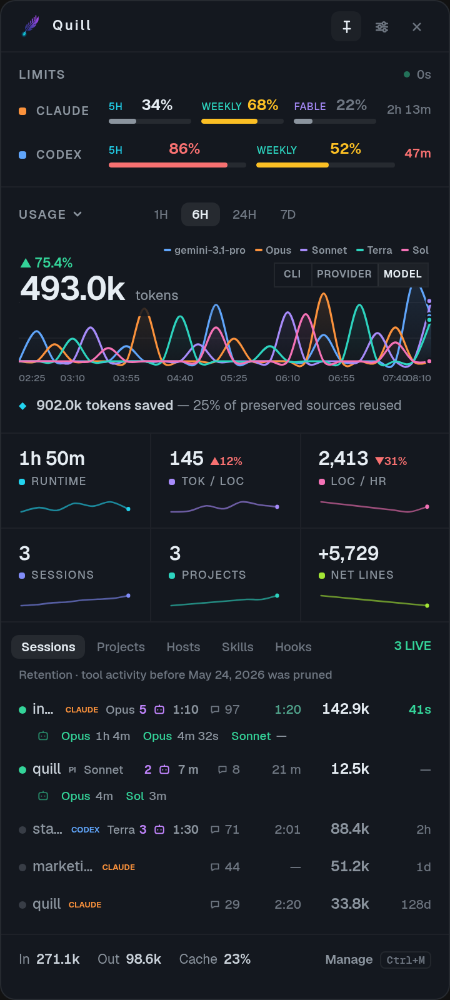
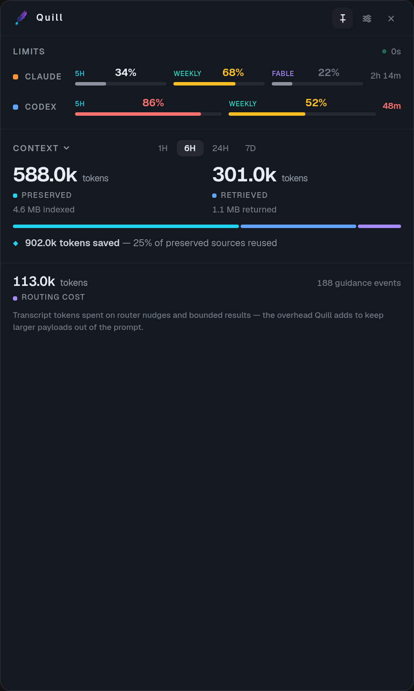
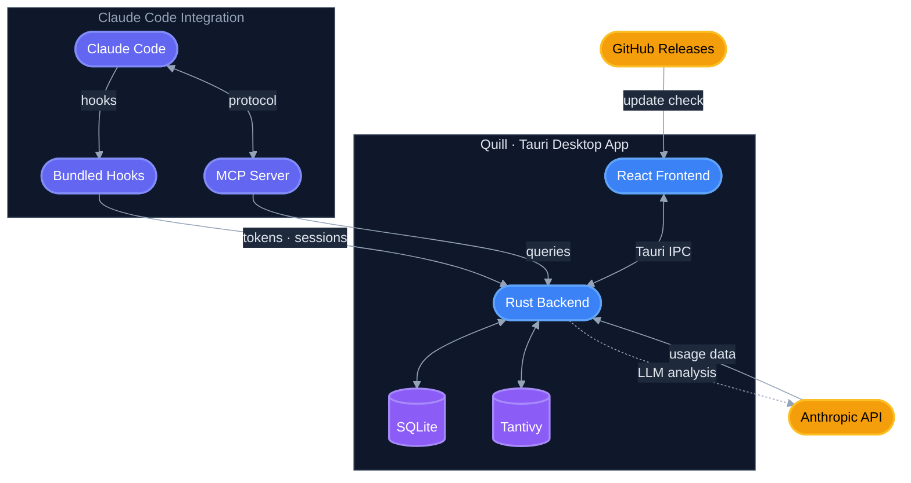

# Quill

<p align="center">
  
</p>

A cross-platform desktop widget that displays your Claude Code, Codex, and other AI assistant usage in a compact, always-on-top floating window — with full-text session search, behavioral learning, and an optional context preservation feature that keeps large working context out of LLM transcripts. Built with Tauri + React.

> Marketing site (live limits, analytics, search, learning): <https://sharaf-nassar.github.io/quill/> · Source under [`marketing-site/`](marketing-site/README.md).

## Features

A one-line tour. Each item links to its full description in [Features in depth](#features-in-depth).

- **[Live usage](#live-usage)** — a LIMITS band pinned above everything else, one row per enabled provider (Claude, Codex, MiniMax), with per-window utilization bars and reset countdowns
- **[Widget views](#widget-views)** — Usage, Models, and Context swap in one region under a shared 1H/6H/24H/7D range strip; widget graphics use an internal SVG kit, so Quill ships no charting dependency
- **[Agent visibility](#agent-visibility)** — sessions show the subagents Quill actually observed running, grouped by model (`2×Opus · 3×Sonnet`)
- **[Multi-account pools](#multi-account-pools)** — connect a local CLI Proxy API instance and LIMITS reports mean pool pressure instead of a single account
- **[Manage workspace](#manage-workspace)** — one rail-navigated window (⌘M / Ctrl+M) holding Sessions, Learning, Instances, and Settings
- **[Session search](#session-search)** — Tantivy-backed full-text search across every Claude Code and Codex session, with filters and snippet highlighting
- **[Token tracking](#token-tracking)** — per-turn input/output/cache counts collected by the bundled hooks
- **[Code stats](#code-stats)** — lines added and removed per session by language, plus tokens per LOC and LOC per hour
- **[Learning](#learning)** — observes tool-use patterns across sessions and extracts reusable rules with confidence scores
- **[Memory optimizer](#memory-optimizer)** — suggests merges, updates, and removals for your memory files; every change is diff-reviewed and undoable
- **[Brevity profile](#brevity-profile)** — a managed instruction block that compresses assistant prose while leaving code, paths, and commands untouched
- **[Working context preservation](#working-context-preservation)** — routes large transient output into a local searchable store instead of the LLM transcript
- **[MCP server](#mcp-server)** — hands Claude Code and Codex `search_history`, plus the context tools when preservation is on
- **[Restart orchestrator](#restart-orchestrator)** — gracefully restart running Claude Code and Codex sessions from inside Quill
- **[Desktop integration](#desktop-integration)** — tray menu, in-app updater, always-on-top, a frameless resizable window, and per-window zoom
- **[Crash reporting](#crash-reporting)** — default-on and opt-out, sending stack frames with every dynamic field stripped locally first

## Screenshots

The main window is an always-on-top widget, 360px wide by default: a LIMITS
band that never leaves the frame, and one view below it that the header's
dropdown swaps.

<table>
  <tr>
    <td align="center"><strong>Usage</strong></td>
    <td align="center"><strong>Context</strong></td>
  </tr>
  <tr>
    <td valign="top"></td>
    <td valign="top"></td>
  </tr>
</table>

Learning, session search, instances, and settings live in the Manage workspace
(⌘M / Ctrl+M); their shots are captured by `scripts/take_screenshots.sh`.

## Architecture


```mermaid
%%{init: {'theme': 'base', 'themeVariables': {
  'primaryColor': '#1e293b',
  'primaryTextColor': '#e2e8f0',
  'lineColor': '#94a3b8',
  'secondaryColor': '#334155',
  'tertiaryColor': '#0f172a',
  'fontFamily': 'ui-sans-serif, system-ui, sans-serif',
  'fontSize': '14px',
  'edgeLabelBackground': '#1e293b'
}}}%%

graph TB
    subgraph Sources [" Claude Code Integration "]
        CC(["Claude Code"])
        BH(["Bundled Hooks"])
        MS(["MCP Server"])
    end

    subgraph Widget [" Quill · Tauri Desktop App "]
        FE(["React Frontend"])
        BE(["Rust Backend"])
        DB[(SQLite)]
        FTS[(Tantivy)]
    end

    API(["Anthropic API"])
    GH(["GitHub Releases"])

    CC -- hooks --> BH
    CC <-->|protocol| MS

    BH -- "tokens · sessions" --> BE
    MS -- queries --> BE

    FE <-->|Tauri IPC| BE
    BE <--> DB
    BE <--> FTS

    API -- "usage data" --> BE
    BE -. "LLM analysis" .-> API
    GH -- "update check" --> FE

    style CC fill:#6366f1,stroke:#818cf8,color:#fff,stroke-width:2px
    style BH fill:#6366f1,stroke:#818cf8,color:#fff,stroke-width:2px
    style MS fill:#6366f1,stroke:#818cf8,color:#fff,stroke-width:2px
    style FE fill:#3b82f6,stroke:#60a5fa,color:#fff,stroke-width:2px
    style BE fill:#3b82f6,stroke:#60a5fa,color:#fff,stroke-width:2px
    style DB fill:#8b5cf6,stroke:#a78bfa,color:#fff,stroke-width:2px
    style FTS fill:#8b5cf6,stroke:#a78bfa,color:#fff,stroke-width:2px
    style API fill:#f59e0b,stroke:#fbbf24,color:#000,stroke-width:2px
    style GH fill:#f59e0b,stroke:#fbbf24,color:#000,stroke-width:2px
    style Sources fill:#0f172a,stroke:#334155,color:#94a3b8
    style Widget fill:#0f172a,stroke:#475569,color:#e2e8f0
```

## Prerequisites

- [Claude Code](https://docs.anthropic.com/en/docs/claude-code) installed and logged in (`claude /login`)

### For development

- [Rust](https://rustup.rs/) (stable)
- [Node.js](https://nodejs.org/) 18+
- System dependencies for Tauri (Linux):
  ```bash
  sudo apt install libwebkit2gtk-4.1-dev libappindicator3-dev librsvg2-dev patchelf
  ```

## Installation

### From releases

Download the latest release for your platform from the [Releases](../../releases) page:
- **Linux**: `.AppImage`
- **Windows**: `.exe`
- **macOS**: `.dmg`

#### Linux setup

**Quick install (recommended)** — fetches the latest AppImage, makes it
executable, installs it to `~/Applications`, and launches it:

```bash
curl -fsSL https://raw.githubusercontent.com/sharaf-nassar/quill/main/install.sh | sh
```

**Manual** — the AppImage is a portable executable, but browsers save downloads
non-executable, so mark it runnable first (it is the only Linux build, and the
only format the in-app updater can self-update):

```bash
chmod +x Quill_*_linux_amd64.AppImage
./Quill_*_linux_amd64.AppImage
```

On first launch Quill offers to add itself to your applications menu (with an icon) — no manual `.desktop` setup needed. You can re-run this anytime from **Settings → General → "Install to applications menu"**. Once added, Quill auto-updates in place.

> Quill no longer ships a `.deb`: Debian installs can't use the in-app updater
> (Tauri only self-updates AppImages), so they were stranded on whatever version
> was installed. If you previously installed the `.deb`, remove it (see below)
> and switch to the AppImage to get automatic updates.

#### Linux uninstall

To fully remove Quill and its data:

```bash
# If installed via .deb:
sudo dpkg -r quill

# If using AppImage:
rm -f ~/Applications/Quill_*_linux_amd64.AppImage

# Remove app data (usage database, auth secret, logs, etc.)
# macOS:
rm -rf ~/Library/Application\ Support/com.quilltoolkit.app
# Linux:
rm -rf ~/.local/share/com.quilltoolkit.app

# Remove hook scripts, MCP server, and config
rm -rf ~/.config/quill

# Remove Claude Code integration added by the app
# (hooks in ~/.claude/settings.json with _source: "quill-setup",
#  MCP entry in ~/.claude.json, and CLAUDE.md section are left in place
#  — remove manually if desired)
```

### From source

```bash
git clone https://github.com/sharaf-nassar/quill.git
cd quill
npm install
cargo tauri build
```

The built binary will be in `src-tauri/target/release/`.

## Setup

The widget reads OAuth tokens from Claude Code's credentials file (`~/.claude/.credentials.json`). Make sure you are logged in:

```bash
claude /login
```

No additional configuration is needed — the widget starts tracking utilization immediately.

### Enabling context preservation (optional)

Open the Manage workspace (⌘M / Ctrl+M, or the settings key in the widget titlebar) and toggle **Working Context Preservation** in **Settings → Context**. Enabling installs the context MCP tool, routing hooks, and capture scripts for currently active providers (Claude Code, Codex). Disabling redeploys the base integration and removes context assets while preserving historical context stores and analytics rows. The widget's **Context** view then reports what the store kept out of the transcript, what came back, and what routing cost.

## Token Tracking, Learning & Session Search

The app includes an HTTP server (port `19876`, configurable via `QUILL_PORT`) that receives data from Claude Code via hooks. This powers three features:

- **Token tracking** — per-turn input/output/cache token counts, powering the Usage view's provider chart, its readout sparklines, and the In / Out / Cache footer
- **Learning** — observes tool usage patterns across sessions and can analyze them to extract reusable rules (stored in `~/.claude/rules/learned/`)
- **Session search** — indexes Claude Code session transcripts for full-text search with filters

The HTTP server uses bearer-token authentication and rate limiting to secure incoming data.

### Local setup (automatic)

When the Quill app runs on the same machine as Claude Code, **everything is configured automatically** on app startup — no manual steps required. The app:

1. Deploys hook scripts to `~/.config/quill/scripts/`
2. Deploys the MCP server to `~/.config/quill/mcp/`
3. Registers hooks in `~/.claude/settings.json`
4. Registers the MCP server in `~/.claude.json`
5. Writes connection config to `~/.config/quill/config.json`
6. Adds MCP usage instructions to `~/.claude/CLAUDE.md`

Just install the app, launch it, and restart Claude Code. Token tracking, learning, session search, and MCP tools will all be active.

### Using the Learning section

Once observations are being collected:

1. Open the Manage workspace (⌘M / Ctrl+M, or the settings key in the widget titlebar) and select **Learning**
2. Toggle learning **ON** with the switch in the section header
3. Choose a trigger mode:
   - **On-demand** — click "Analyze" in the status strip to run analysis manually
   - **Periodic** — runs on a configurable interval once enough new observations have accumulated
4. Analysis extracts patterns from observations and creates rule files in `~/.claude/rules/learned/`
5. Learned rules appear as cards under **Rules** with confidence scores and domain tags; **Runs** docks the analysis history beside them

### Verify

```bash
# Check the server is running
curl http://localhost:19876/api/v1/health

# Send a test payload
curl -X POST http://localhost:19876/api/v1/tokens \
  -H 'Content-Type: application/json' \
  -d '{"session_id":"test","hostname":"dev","input_tokens":100,"output_tokens":50,"cache_creation_input_tokens":10,"cache_read_input_tokens":5}'
```

## Development

```bash
npm install
cargo tauri dev
```

## Controls

- **Drag the titlebar** to move the widget; **drag any edge or corner** to resize it (floor 320×200, no ceiling) — both position and size are remembered
- **Pin key** in the titlebar toggles always-on-top
- **Settings key** in the titlebar opens the Manage workspace at its Settings section
- **Close key** in the titlebar hides the widget to the tray; Quill keeps running
- **View name** below LIMITS opens the view list — Usage, Models, Context
- **1H / 6H / 24H / 7D** re-scopes every band of the active view at once
- **⌘M / Ctrl+M**, or the Manage button in the Usage footer, opens the Manage workspace
- **⌘K / Ctrl+K** inside Manage opens the command palette
- **Right-click the widget** for Refresh and Quit
- **System tray menu** — Show Widget, Always on Top, Check for Update, and Quit
- **Ctrl+/- (or Cmd+/-)** to zoom and **Ctrl+0** to reset, remembered per window

## Features in depth

Every entry in the [Features](#features) list above, in full.

### Live usage

The LIMITS band is the one region that never scrolls away — provider rate-limit
pressure, read as an instrument.

- One identity row per enabled provider (Claude, Codex, MiniMax); the whole band is absent when no provider is enabled
- One cell per rate-limit window: rounded percentage, compressed window label, and a 4px severity bar. Cells divide the row's meter region evenly and reflow at their legible minimum
- Severity is reserved for real thresholds — green below 50%, amber from 50%, red from 80%
- A window whose reset has already elapsed renders stale (muted percentage, neutral bar) instead of carrying bygone utilization as a live alarm, and it is excluded from the row's nearest-reset countdown
- Right-aligned countdown to each row's nearest upcoming reset
- A provider with no live buckets still states why: `SETUP` in amber when the failure is actionable (auth, config, an unfinished install), `UNAVAILABLE` in slate otherwise
- Degraded reads surface on the LIMITS header's sync control — "Showing cached data", "Paused" for a stale token, "Offline — showing cached data" — never as a false severity. The same control takes a manual refresh that bypasses freshness guards while still honoring rate-limit and network cooldowns
- Sources: Claude via the Anthropic OAuth usage API, Codex via `codex app-server` rate limits (transcript token counts as fallback), MiniMax via its coding-plan API. MiniMax is service-only — an API key, no local CLI

### Widget views

Everything below LIMITS is one swappable view region. The view name and a shared
1H/6H/24H/7D range strip sit in the region's header, so switching views keeps the
selected window. Every chart is drawn by an internal SVG kit — Quill ships no
charting dependency.

- **Usage** (default) — a per-provider stacked area chart with the range's total tokens and an in-range momentum delta overlaid, a hover-only legend chip, one computed insight line, a 3×2 readout grid (LLM runtime, tokens per LOC, LOC per hour, sessions, projects, net lines) where each metric carries its own sparkline, a switchable breakdown (Sessions, Projects, Hosts, Skills, Hooks), and an In / Out / Cache footer
- **Models** — a running-now strip per provider plus the session-ranked model list; raw model ids exactly as observed, qualified by a provider swatch, with attributed tokens beside each
- **Context** — preserved and retrieved token totals with a split bar, the shared cache-savings line, and the routing cost
- Honesty disclosures keep the home that matches their data: the Hooks breakdown carries the Claude/Codex tracking-asymmetry note, and a condensed retention line appears wherever pruning affects what is drawn

### Agent visibility

Sessions in the Usage breakdown report the subagents Quill observed for that
session, so a row shows the work fanned out beneath it rather than just its own
turns.

- A row with positive lifecycle evidence renders an agent icon and a tabular model breakdown such as `2×Opus · 3×Sonnet`; Claude tiers sort Opus → Sonnet → Haiku → Fable and Codex tiers sort Sol → Terra → Luna
- Counts come from observed starts without matching stops inside a trustworthy current-boot epoch — evidence of observed agents, not a liveness probe
- Anything less than positive evidence renders nothing at all: zero, disabled coverage, and incomplete coverage make no numeric claim. Lost parent-end delivery falls back to no claim once the 15-minute inactivity bound expires
- An active session with no retained token metrics shows an em dash for tokens rather than implying zero usage
- Models resolve from retained transcripts where available, with a validated start-time type as the interim label

### Multi-account pools

If you route several accounts through a local [CLI Proxy API](https://github.com/router-for-me/CLIProxyAPI)
instance, Quill can read the whole pool instead of one account. Configured from
**Settings → Integrations**.

- The form takes a loopback URL (default `http://127.0.0.1:8317`) and the plaintext management key; a bcrypt hash pasted from CPA's config is rejected up front, since it cannot authenticate
- Connecting validates the management endpoint and runs one Claude and one Codex quota smoke check; a provider whose check fails stays in health-only mode rather than blocking the connection
- Each pool row aggregates routing-usable accounts: mean utilization per window across healthy accounts, an inline healthy/total count, and a per-window reset taken from the earliest contributing account. Missing buckets are excluded, never read as zero
- A pool row replaces that provider's direct row while it exists, so a provider never appears twice; the direct row returns when the pool does not
- Disconnecting purges the saved URL, key, CPA runtime rows, and CPA-derived snapshots, and advances the usage cache epoch so an in-flight refresh cannot resurrect them. Direct provider data is untouched

### Manage workspace

One rail-navigated window for everything that is not live monitoring, opened
from the widget titlebar's settings key or the ⌘M / Ctrl+M accelerator.

- Four sections — **Sessions** (search), **Learning** (rules, memory, runs), **Instances** (restart), and **Settings**
- ⌘K / Ctrl+K opens a command palette over the sections plus Back-to-Live and Close-Tools actions
- **Settings** tabs: General, Integrations, Context, Learning, and Performance

### Session search

- Full-text search across all Claude Code and Codex sessions (powered by Tantivy)
- Filter by provider, project, host, role, and date range; sort by relevance or recency
- Snippet highlighting with expandable message context and a session detail panel
- Indexes subagent transcripts and Codex inter-agent messages alongside root sessions
- Lives in the **Sessions** section of the Manage workspace

### Token tracking

- Per-turn input/output/cache token counts via the bundled Claude Code and Codex hooks
- Feeds the Usage view's provider chart, the readout sparklines, and the In / Out / Cache footer
- Delivered over a local HTTP server with bearer-token auth — see [Token Tracking, Learning & Session Search](#token-tracking-learning--session-search)

### Code stats

- Lines of code added/removed tracked per session, grouped by language
- Net lines, tokens per LOC, and LOC per hour sit in the Usage view's readout grid, each with its own sparkline

### Learning

- The Manage workspace's **Learning** section shows learned usage rules, observation stats, and analysis history
- Trigger modes: on-demand, or periodic once enough new observations have accumulated
- Rule lifecycle tracking (candidate → awaiting review → active, plus rejected, suppressed, superseded, and conflict-flagged states)
- Domain-grouped rules with confidence scores, written to `~/.claude/rules/learned/`
- Run history with real-time analysis logs, opened as a docked panel beside the rules
- Git history integration for cross-source pattern synthesis

### Memory optimizer

- Scans your Claude Code memory files and suggests improvements (merge duplicates, update stale content, remove obsolete entries)
- Approval-based workflow — review each suggestion with a diff preview before applying
- Undo any applied change to restore the original file
- Batched "optimize all" to review and apply suggestions across an entire project
- Optional **Compress prose** pre-pass — rewrites every eligible memory file in caveman style via Anthropic Haiku before the optimizer runs. Skips instruction files, files over 500 KB, files on the secrets denylist, and files that already have an `.original.md` backup. Validates that headings, code blocks, URLs, file paths, and bullets are preserved; on failure restores the original. Successful rewrites leave a `<file>.original.md` backup next to the compressed file so the change is reversible

### Brevity profile

- Toggled from **Settings → Context** in the Manage workspace, and applied to whichever providers (Claude Code, Codex) are enabled
- Injects a managed "Quill Brevity Profile" instruction block into the provider's primary agent file (`~/.claude/CLAUDE.md` for Claude Code, `~/.codex/AGENTS.md` for Codex), asking the assistant to write in a compressed caveman style for its own prose responses while preserving code blocks, file paths, URLs, library names, command names, numbers, env vars, and markdown structure exactly
- Symlink-aware — when `AGENTS.md` is a symlink to `CLAUDE.md`, only one block is written so the same instructions are not duplicated
- Toggling off strips just the managed block; the rest of the agent file is left untouched
- MiniMax does not have a managed agent file, so brevity is unavailable for it

### Working context preservation

- Optional, default-off feature toggled from **Settings → Context** — keeps large transient context (web pages, file reads, command output, search results) out of the LLM transcript by routing it through a local searchable store
- **Context MCP tools** — when enabled, installs `quill_index_context`, `quill_search_context`, `quill_get_context_source`, `quill_execute` / `quill_execute_file` / `quill_batch_execute`, `quill_fetch_and_index`, `quill_purge_context`, and `quill_context_stats` so the assistant can store, search, and retrieve focused chunks instead of dumping content into the conversation
- **Routing hooks** — block raw `WebFetch` and noisy `curl`/`wget` dumps, nudge broad `Bash`/`Read`/`Grep`/build/test output toward `quill_*` tools, and use per-session marker files to avoid repeating guidance
- **Telemetry** — every preservation event reports compact byte and token estimates to the widget's Context view; large content stays in the local context store and never enters the analytics database
- Toggling the feature deploys or removes context scripts, the context MCP tool, instruction templates, and hooks for currently enabled providers; historical context stores and analytics rows are preserved on disable
- Available for both Claude Code and Codex via their respective integrations

### MCP server

- Gives Claude Code (and Codex) direct access to your indexed session history and — when context preservation is enabled — the working context store
- Session-history tool:
  - **`search_history`** — full-text search across all sessions by content, edits, commands, or tool use (filter by project, git branch, role, date)
- Context tools (only when context preservation is enabled): see [Working context preservation](#working-context-preservation)
- Automatically configured when the app starts — no manual setup needed

### Restart orchestrator

- Discovers running Claude and Codex sessions — Claude from Quill's hook-written state files plus process scanning, Codex from process scanning and session metadata per working directory
- Restarts in four phases with live status events: discover, wait for idle where the provider exposes one, SIGTERM and wait for exit, then resume (`claude --resume`, `codex resume`). Force restart skips the idle wait
- Codex has no reliable idle signal, so its rows stay `Unknown` rather than claiming an idle transition Quill never observed; ambiguous Codex process or session mappings are omitted instead of guessed
- Per-instance status — Idle, Processing, Unknown, Restarting, Exited, RestartFailed — with cancel support
- Lives in the **Instances** section of the Manage workspace

### Desktop integration

- **System tray** with Show Widget / Always on Top / Check for Update / Quit
- **In-app updater** — checks on startup and every 4 hours; a cyan "Update" button then appears centered in the widget titlebar
- Always-on-top toggle in the widget titlebar, sharing one persisted setting with the tray checkitem and Settings
- Frameless, transparent, near-black flat surface with a drag-to-move titlebar and a resize border on all four edges and corners
- Geometry belongs to you: the window resizes freely above a 320×200 floor with no ceiling, and both size and position are restored across restarts. Only the column below the titlebar scrolls, so the widget stays usable when dragged shorter than its content
- Closing from the titlebar hides the widget to the tray rather than quitting
- Refreshes usage every 3 minutes while the widget is open; an optional background refresh (60–600s, Settings → Performance) keeps the tray indicator current while it is hidden
- Read-only OAuth — reads Claude Code's token, never refreshes it
- On Linux, a first-launch prompt (re-runnable from **Settings → General**) adds Quill to the applications menu
- **Zoom controls** — Ctrl+/- to zoom, Ctrl+0 to reset, persisted per window

### Crash reporting

Default-on and opt-out, toggled by the "Help improve Quill" row at the bottom of
**Settings → General**. It reports crashes without reporting your work.

- Both the Rust and frontend surfaces run a deny-by-default scrubber before anything leaves the process: messages, exception values, breadcrumbs, request data, user context, extras, and absolute file paths are all stripped. Only stack-frame structure plus release, environment, and runtime tags survive
- Session replay, browser tracing, session tracking, and HTTP context capture are disabled — the reporter is a crash handler, not analytics
- Toggling applies immediately on both surfaces: opting out flushes pending events and closes the transport, opting back in re-initializes it

## License

MIT
